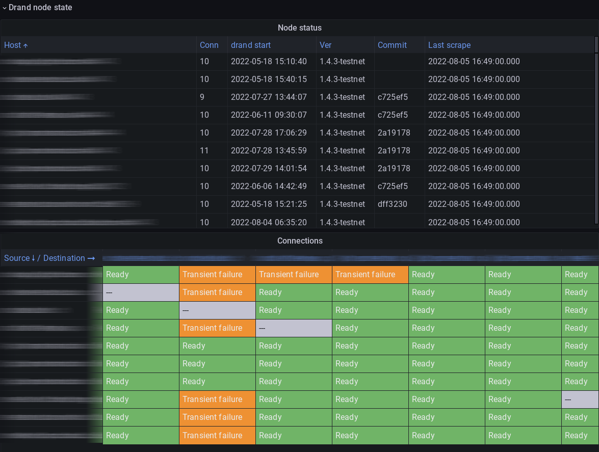
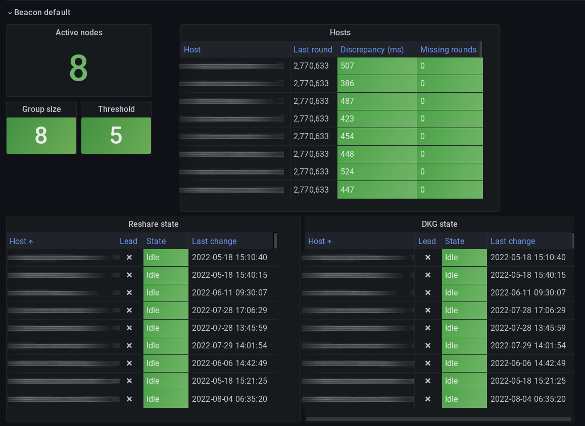

_Monitoring distributed systems is a challenge. While there are established patterns and solutions for monitoring the most common types of applications, there is usually no silver bullet. In this blog post we outline the challenges that we faced when implementing monitoring for one such system, drand._

## Observing Randomness

Monitoring distributed systems is a challenge. While there are established patterns and solutions for monitoring the most common types of applications, they usually assume a run-of-the mill application:

- It is web based.
- All nodes and networks are controlled by a single organization.
- There is a single centralized repository which stores all nodes’ metrics.
- Each node knows only of its own metrics and has no view of other nodes’ state.

Therefore, the challenges are multiplied if your application is not web-based, running on nodes and networks that are controlled by diverse organizations and you want to enable each of the participating organizations to have a global view of the application without being tied to a single repository. In this blog post I will outline the challenges that we faced when implementing monitoring for one such system, drand.

## What is drand?

[Drand](https://drand.love/) is a public, verifiable, unpredictable and unbiased randomness beacon. It is based on the idea that, to generate randomness in a reliable and trustworthy way, you cannot depend on a single entity to control the infrastructure where it runs. For this, we have sought the collaboration of multiple organizations to run their own drand daemons, forming the [League of Entropy](https://blog.cloudflare.com/league-of-entropy/) (*LoE*) - a distributed organization where each of the participating partners runs a drand node. There are other resources, such as the project’s [documentation pages](https://drand.love/docs/), which explain the cryptographic details regarding how randomness is generated by multiple parties using threshold cryptography. This blog post will instead focus on the challenges we faced when we tried to design, implement and deploy monitoring infrastructure for this distributed network.

As a little bit of background, a drand *network* is composed of multiple *nodes*. A given network is also sometimes called a *beacon chain*, since each network generates separate randomness beacons at a specific interval, called also a *round*. The number of nodes on a network is fixed at any given point in time and is only changed during a *ceremony*. During the ceremony a *threshold* is set, which is the minimum number of nodes that need to be connected to the network at any given time for randomness generation to succeed.

## The need for monitoring

To ensure security, we do not allow just any host to join the network at any time. Whenever a host joins or leaves the network, we hold what is called a “ceremony”, where cryptographic keys are refreshed and exchanged. In between ceremonies the list of hosts that participate in a drand network is static. Ceremonies are usually held quarterly, regardless of whether any node joins or leaves the network. Before each ceremony, an allowlist is distributed to all the participants, which contains the IP addresses of all nodes in the network. This is done so that LoE members can open the appropriate firewall ports.

One issue with the ceremonies is that it is a synchronous operation where all node operators need to be at the keyboard at the same (window of) time and execute certain commands on their nodes at the correct moment and in the correct order. Since nodes and operators are located all around the world, it is a challenge to coordinate a time that is convenient for everyone, and that does not even account for unforeseen reasons of why a node operator might be unavailable. In the past this has led to delaying or even postponing some ceremonies.

There are other things that can go wrong during a ceremony. One of the nodes might not be running the appropriate version of `drand`; the node operator might restart their node in the middle of the ceremony, which then puts their node in an incorrect state to continue; there might be connectivity problems which do not allow a node to correctly participate; and so on and so forth. Up until now, the coordination between operators has been through off-band channels (such as email or Slack), which resulted in postponed or cancelled ceremonies. The difficulties in coordinating a ceremony through such means surfaced the need to have full visibility into the drand network and the state of each node participating in it, in order to ensure that all nodes are in the correct state and that everything happens at the right time and in the right order.

The ultimate target of the LoE with regard to ceremony operations is to be able to carry out “async ceremonies”. In this setup, a timeframe will be set up for all operators executing the appropriate commands without everyone having to be online at the same time. This will become more important as the drand network grows and more participants in different timezones join the league. A monitoring tool that provides an accurate view of nodes and network states, as well as the operations that are being carried out is clearly an absolute necessity.

## Monitoring architecture requirements

To properly monitor the drand network we have some requirements:

**Allow any LoE member to create their own monitoring infrastructure**

We did not want to mandate using a specific metrics aggregation platform (e.g. Prometheus or InfluxDB), instead allowing for each organization to select the one that best meets their needs or with which they are most familiar.

**Ease of deployment**

We did not want to burden operators with complex deployment strategies, so we decided to modify the drand binary itself instead of adding a new binary to export the metrics.

**Minimize the need for opening network ports**

Since drand nodes are run by multiple organizations on their own networks, any changes to the firewall configuration increases friction and reduces the probability of success. Ideally no network ports other than the one used for generating randomness should need to be opened. At the very least no more incoming ports should be needed.

**Use industry-standard formats where possible**

To decrease the ramp-up time for integrating into an organization’s monitoring system, we need to use an industry-standard format to publish metrics.

**Ability to see the state of the whole network from any point in the network**

To allow all LoE members to create their own dashboards and alerts, we need to enable each node to provide a full view of the whole network.

**(Close to) real-time view of the network state**

Especially during ceremonies, it is important to see changes in node state as soon as possible (< 1 minute) after they happen.

## Design decisions

The above requirements led us to the following design:

**Each node exposes its own metrics in Prometheus format**

Prometheus is an industry-standard format, and each node exposing its own metrics allows anyone to monitor their own node directly.

**Additionally, each node is able to retrieve any other connected node’s metrics and expose them in Prometheus format**

This enables not only Protocol Labs but any LoE member to create their own dashboards showing the state of the whole network.

**The transport of metrics between nodes is done using the same mechanism that drand uses for inter-node communication when generating randomness (GRPC)**

With this we allow metrics to be sent between nodes, while not requiring opening any additional network ports.

**For the Protocol Labs dashboard, gather the metrics using Telegraf and export them to InfluxDB, which we can access via Grafana Cloud**

This enables us to gather metrics from the whole swarm into a central location and create an easy-to-use dashboard. The scraping interval is set to one minute, and it can be lowered during ceremonies in order to get faster network state updates.

## Metrics design

To start with, we had to decide what we needed to monitor on each node. We came up with the following minimal information requirements for running a smooth ceremony:

- Version of `drand` that the node is running, in order to ensure that all nodes are running the same/correct version.
- Whether nodes have restarted their daemon ahead of the ceremony, to ensure that the certificate is still valid and to clear the process’ memory and storage.
- Whether nodes have connectivity to all other nodes.
- What is the current ceremony state of the node.

We also came up with the idea of using the dashboard for ongoing monitoring of the network (not only during ceremonies), for which we added the following for each beacon in each node:

- When was the last randomness generated.
- What is the last round generated by the node for that beacon chain.
- What is the time difference between this node and other nodes (including network round-trip times).

The drand code was already instrumented to provide some of the required metrics via a Prometheus HTTP endpoint, while others needed to be added.

## Inter-node communications

As mentioned above, one of the requirements was to be able to view the state of the whole drand network without requiring node operators to open any additional holes in their firewall, nor to connect to any hosts other than those included in the drand network itself. Therefore, it was necessary to enable the possibility of fetching a remote node’s metrics via the same method used to coordinate randomness generation: that is, through GRPC.

We also wanted to reduce the amount of metrics traffic between nodes, so we went with a pull system where any node can pull any other node’s metrics when requested. For that we exposed an additional HTTP endpoint that includes the peer’s ID to get Prometheus metrics for the associated peer. A request to that endpoint makes a gRPC call to the remote node to get the metrics before returning them to the client. With this we have the ability to get metrics from all nodes in the drand network, without any unnecessary additional traffic.

The Protocol Labs nodes all run instances of [Telegraf](https://www.influxdata.com/time-series-platform/telegraf/), whose configuration is hard-coded to get the metrics from all nodes in the drand network. This is possible because the nodes in the network are static and only change during ceremonies. Telegraf then pushes the metrics into [InfluxDB](https://www.influxdata.com/). We then use [Grafana](https://grafana.com/) to visualize the data.

Regarding LoE members, the fact that metrics are exposed using the industry-standard Prometheus format and that any node can gather metrics from any other node in the network makes it possible for any of them to create a setup similar to this and gather metrics into their own observability solution.

## Dashboard design

As is usually the case, it took multiple iterations to get to a dashboard design that was useful and also comprehensible. These iterations involved both changing the layout and organization of the presented information, as well as adding metrics that were missed during initial analysis. For example, during ceremonies some of the state changes happen so fast that they were missed by the polling and dashboard refresh intervals, so we added timestamps to be able to see whether a state had changed or not. We also reformulated some metrics labels to reduce cardinality.

We ended up with a dashboard with 2 sections. The first section includes connectivity information for each node, as well as a connectivity matrix showing which nodes are connected to which other nodes. This has enabled us to find problems such as firewall misconfigurations or bugs impacting connectivity.

The second section contains information about each of the beacons in the given network, including the ceremony state for each node. This allows us to track ceremonies, as well as ensuring that all nodes are up to date with all other nodes.

## Results

We have already deployed and used the new dashboard in the last set of ceremonies that we carried out in our testnet network. It has proven to be an extremely useful tool. We were able to spot connectivity problems and other inconsistencies in a totally async manner, which in turn enabled us to resolve issues much faster. This has given us confidence to run the next testnet ceremony in an asynchronous manner, without having to coordinate all operators being in front of their keyboards at the same time.

Beyond ceremonies, we now have a much more detailed view of the state of the LoE drand network.

## Next steps

As is the case with pretty much any software tool, many more features can be added and several of the existing ones can be optimized. However, what we have is already a big step forward and gives us much higher confidence in the process, compared to the ceremony procedure we used to have.

Some of the issues we have found that we would like to fix in future versions of the monitoring infrastructure are:

- _Consistency._ We sometimes see some measurements toggling between 2 numbers in the dashboard. The reason for this is, we are gathering metrics from all hosts and storing them in InfluxDB. However, some of these metrics are system-wide, and since this is a distributed system, some hosts might have slightly different views of the state of the network than other hosts (especially during ceremonies). While this is not a widespread problem, it can be confusing.
- _Visibility of new nodes._ When a new node joins the network, we are unable to see it in the dashboard until the ceremony is finished. We would like to have some way of monitoring the state of a new node.
- _Visibility in the case of connectivity problems._ Since we are scraping the metrics from the PL nodes, if a node cannot connect to any of them we cannot gather its metrics. While this is mitigated by scraping from all PL nodes instead of just one, we still run the risk of missing a node’s metrics if it cannot connect to any PL nodes.
