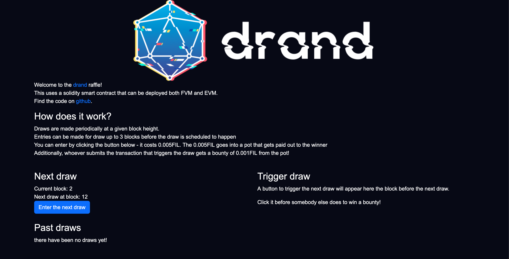
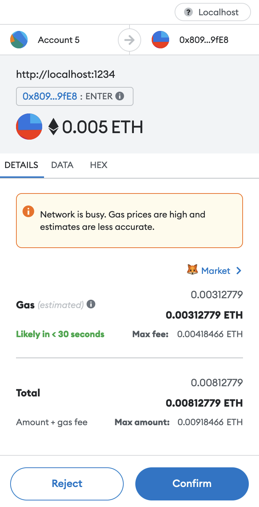
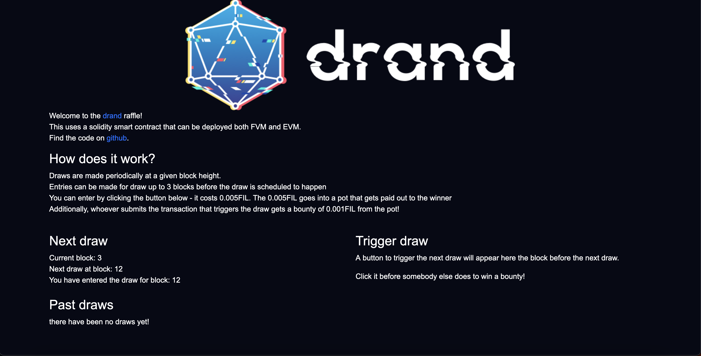
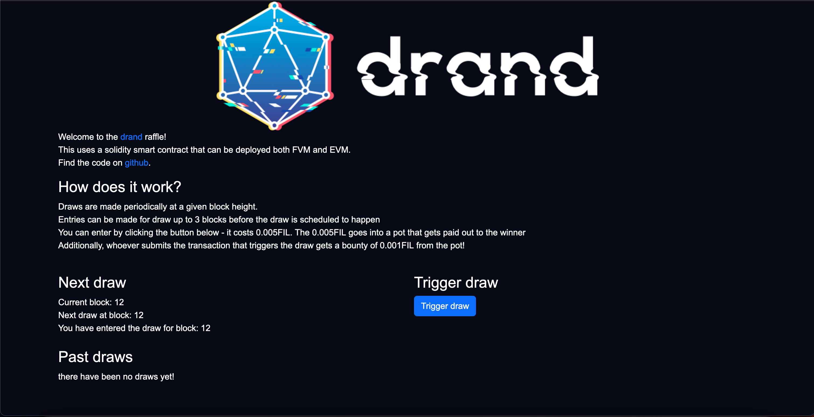
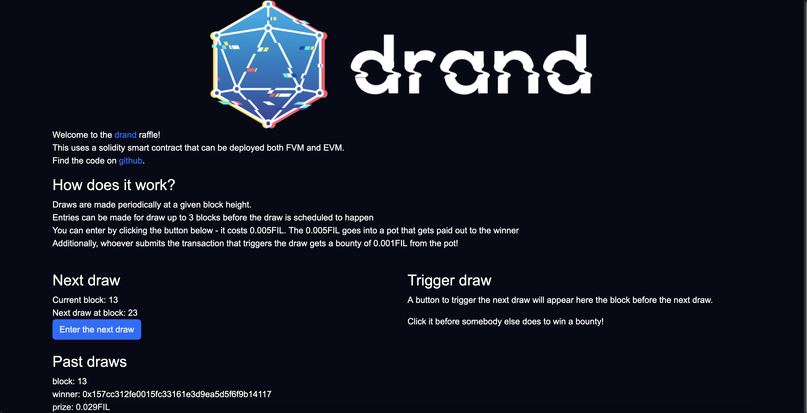

To mark the launch of user programmable smart contracts on the FVM, the drand team is releasing a 3 part blog series into using randomness on the FVM!
In this first part, we dive into the `prevrandao` EVM opcode (the FVM fully supports EVM bytecode!), a sample solidity contract using it, a UI to interact with it, and some other necessary plumbing to make it all work.

If you want to skip all the wonderful learning, you can jump straight into the demo project we developed [on github](https://github.com/drand/draffle) - the contract is deployed at address `0x9D38f3BB80D98cE09C3f0936Bea140181d4CCABA` on the Hyperspace testnet!
A little familiarity with [solidity](https://soliditylang.org/) will be helpful to follow along, but anyone familiar with a C-style language should be able to get the gist.

## Randomness on the blockchain

When developers think of randomness, we most often think of private randomness - for example [using a cryptographically secure pseudorandom number generator](https://en.wikipedia.org/wiki/Cryptographically_secure_pseudorandom_number_generator) such as [/dev/random/](https://en.wikipedia.org/wiki//dev/random) to generate a private key. When executing a smart contract in a blockchain ecosystem however, this poses a few challenges: who provides the randomness? how do I know it's random? If I interact with a smart contract, I can't trust the author to generate randomness for me as they may have a vested interest in the outcome. Similarly, I can't trust the miners to generate the randomness for me, as they too might have an interest in the outcome (or wish to collude with other participants).

To be more concrete: suppose I'm running a raffle via smart contract, and users enter the draw by calling a function such as the following:

```solidity
address[] entrants;

function enter() external {
    entrants.push(msg.sender);
}
```

Everybody who submits a transaction (and has it mined) has their address added to the list of entrants, which will be "randomly" drawn from.
As the *totally unbiased* author of the smart contract, I've provided another function that allows me to draw the randomly chosen participant:

```solidity
event Winner(address theWinner);
function draw(uint32 someTotallyRandomNumber) external {
    require(author == msg.sender, "Only the completely unbiased author can execute the draw winner!"); // assuming we have set the `author` field in the constructor somewhere
    emit Winner(entrants[someTotallyRandomNumber]);
}
```

Of course in blockchain-land, the state of the contract is public to everybody, and I as the author could simply register my own address as an entrant and pass in its index to win the raffle myself!

## How Ethereum increases fairness

To get around this, the folks in the Ethereum community created a DAO (Decentralised Autonomous Organisation) for providing randomness called [RANDAO](https://github.com/randao/randao). Essentially, in a given block 128 addresses from the network can contribute their own piece of randomness by sending a small amount of ETH to the contract and a hash of their chosen random number. 6 blocks later they choose to reveal their number and get paid an ETH bounty, or not to reveal that random number lose the small amount of ETH they deposited. The revealed numbers get combined together to create a final random number, and this is included in the block, and is available to smart contract executions in the next block using the `prevrandao` opcode.
So how does this compare to our *totally unbiased* author's 'random' number in the previous section?

Well, firstly it's verifiable - users can inspect the contract state from the RANDAO contract and see all the inputs that were combined to create the final random number. This at least attests to the method of construction and provides transparency to the process. More importantly though, it's much harder to bias - instead of relying on one *totally unbiased* author, we have up to 128 parties involved in creating the randomness - a much higher bar to cross to influence the output.

So we're done right? 

Well, not quite. It's true that the output of RANDAO is much, much, much better than some *totally unbiased* author, but it's actually possible to influence RANDAO's output.
We discussed that participants of RANDAO commit to some random number ahead of time by providing the corresponding (SHA-3) hash of that number, then a few blocks later they can choose to reveal or not reveal that number (incidentally referred to as a [commit/reveal scheme, or just commitment scheme](https://en.wikipedia.org/wiki/Commitment_scheme)).
If you happen to have the last 'slot' in the random values, you can decide to reveal or not reveal your number and bias the output - this is called 'last mover's advantage'.

To illustrate this, let's imagine that instead of 128 slots, we have 10. Let's also imagine that each participant gets to decide a single bit of the output number (this isn't *exactly* how it works, but it's a useful way to think about the problem):

Number | 1 | 1 | 0 | 1 | 0 | 0 | 0 | 1 | 0 | ? |  
Slot   | 0 | 1 | 2 | 3 | 4 | 5 | 6 | 7 | 8 | 9 |

Let's assume our committed number is `1`.

If we can see the prior bit selections from other participants before us, we can precompute outputs of smart contracts based on whether we reveal or not. If we had a coin-flipping smart contract that simply takes the last randomness bit and returns tails for 0 and heads for 1, if we have bet on tails we could reasonably not reveal our random number (1) to ensure the smart contract outputs 0, assuming the payout for the coinflip is greater than the cost of being penalised for not revealing.

Of course in practice, it's not quite as simple as this - users don't directly influence a bit so their influence will be probabilistic and not direct (i.e. they can increase the chance of certain outputs and reduce the chance of others), but for bigger players who can fill more of the 'slots' of RANDAO, this could still amount to undue influence.

## RANDAO on FVM

RANDAO on EVM is still great - the above is more an insight into some of the security assumptions around it, as a way of introducing FVM's approach to RANDAO and contrasting it.
As the FVM is EVM compatible (i.e. everything possible in EVM bytecode is also possible on the FVM), it must also provide a `prev_randao` opcode for use in smart contracts and compatibility purposes. Instead of bridging to Ethereum or running its own RANDAO (both of which could happen in future), Filecoin already has its own source of randomness used for leader election: [drand](https://drand.love/).

drand is a [threshold network](https://en.wikipedia.org/wiki/Threshold_cryptosystem) that provides publicly verifiable, unbiasable randomness. It exploits the fact that the hash of a signature is indistinguishable from randomness to people without the associated private key. A threshold network is a network of nodes who can cooperatively perform actions such as signing, should enough of the nodes work together (this count of this 'enough' number is referred to as the 'threshold'). Using a form of [shamir secret sharing](https://en.wikipedia.org/wiki/Shamir%27s_secret_sharing), the network creates a cryptographic keypair together that no single member of the group has the private key of; instead they each get a share of that private key, and must aggregate a threshold number of signatures together in order to create a full signature on behalf of the entire group.

Unlike RANDAO, nodes cannot influence the final random output - in fact, once the keypair is generated, all future random numbers have already been deterministically decided, simply nobody can get them until they've received a threshold number of signatures for each number. One drawback is that if a threshold number of nodes were to be compromised, all future random numbers could be derived!

In Filecoin, the drand randomness beacon for the current time is included in every block's headers. When a contract calls the `prevrandao` opcode, the randomness from the previous block is provided to it. This provides a simple method of using randomness on-chain, although with some pitfalls which we'll discuss in due course!

Okay - without further ado let's jump into the web app and code!

## The UI

When the user first opens the UI, they should see something like this:



On the left-hand side we see when the next draw is scheduled, the current block and any draws that have already happened. There’s also a button labelled ‘Enter the next draw’ that we can click to pay the entry fee via our metamask wallet. When we click it, a popup from metamask such as the following appears:



Once we’ve confirmed the transaction, we’ve now entered the draw:



If you’re on hyperspace, we can wait up to 24 hours (the default) until the next draw is scheduled, and we will be able to trigger it (in the next section we’ll find how to reduce that to any time we want for easier testing).
At the time of the draw, the right-hand side of the UI will have changed:



At the draw block height, users will be able to compete to trigger the draw and receive a small payout. Once the draw has been triggered, a new one is scheduled:



## The contract

First off, in the `./contracts/` directory, we have a single file called [DRaffle.sol](./contracts/DRaffle.sol). It contains the solidity code which will be run on FVM to manage all the entrants and payouts from the contest.
Let's take a look at its constructor and fields:

```solidity
uint256 costPerDraw;
uint256 drawCutoff;
uint256 triggerReward;
uint256 nextDrawBlockHeight;

address[] candidates;

constructor(uint256 roundCutoff, uint256 cost, uint256 reward) {
    costPerDraw = cost;
    triggerReward = reward;
    drawCutoff = roundCutoff;

    scheduleNext();
}
```

The first field set in the constructor enables the author of the contract to choose a `cost` of entry (in FIL). All entrants will pay it, and (nearly all of) the total pool for every draw will be paid out to the winning address.
The second field set is a `reward` for users who initiate the draw. As the contract runs on-chain, we can't easily (in solidity anyway) schedule future draws automagically - we have to rely on somebody in the ecosystem submitting a transaction to trigger the draw. To incentivise that, we'll provide a small FIL bounty to cover the transaction fee plus a little extra, so users will want to trigger the draw.
The final field set - `drawCutOff` - is the number of blocks in advance we wish to close entries for a given draw. 
Readers with a keen eye will have noticed in the explanation of the `prevrandao` instruction, that it returns the randomness from the *previous* block header, and not the current block. Entrants could therefore know the random number used for a draw in advance of the draw happening. In follow-up blog posts, we'll discuss how we can use more current randomness to avoid this pitfall, but for now let's close draws a few blocks in advance to eliminate this possibility of gaming the draw.

Finally the constructor calls the `scheduleNext` function which will set the `nextDrawBlockHeight` field, clear any candidates and emit some convenient events for the UI to consume. It's implementation is as follows:

```solidity
function scheduleNext() internal {
    candidates = new address[](0);
    nextDrawBlockHeight = block.number + 2880;
    emit Scheduled(nextDrawBlockHeight);
}
```

With this implementation a draw will happen once every 24 hours (Filecoin mines a block every 30 seconds, i.e. 2 per minute, 60 minutes per hour, 24 hours per day- 2 * 60 * 24 = 2880), but it can easily be configured to be more frequent.

Now to our function users will call to enter the draw:

```solidity
function enter() external payable {
    require(msg.value == costPerDraw, "you have passed too much or too little money to enter the lotto");
    require(block.number < nextDrawBlockHeight - drawCutoff, "It's too close to the next draw to participate");
    candidates.push(msg.sender);
}
```

It's quite simple: users must pass a token amount equal to the `costPerDraw` into the contract with their transaction (hence the `payable` keyword). If they correctly do that and it's not too close to the draw (remembering our `prevrandao` limitation discussed above!), their address is added to the candidate list for the draw.

The final important function is the draw function itself:

```solidity
function draw() external payable {
    // first we ensure that users can't trigger the draw too early
    // we let them draw late, because perhaps nobody could get a transaction mined for the exact block height!
    require(block.number >= nextDrawBlockHeight, "it's too early to trigger the draw!");

    // if nobody entered the draw, and thus there is no money to pay out, we send an event that there was no winner and
    // just schedule the next draw
    uint numberOfEntries = candidates.length;
    if (numberOfEntries == 0) {
        emit NoWinner(block.number);

    // if there are candidates for the draw, we use the `prevrandao` value from the block, and turn it into an index to choose the winner.
    // note: using the modulo operation can result in an output bias - check this great blog post on the matter: <https://research.kudelskisecurity.com/2020/07/28/the-definitive-guide-to-modulo-bias-and-how-to-avoid-it/>
    } else {
        address winner = candidates[block.prevrandao % numberOfEntries];
        uint256 amount = numberOfEntries * costPerDraw - triggerReward;

        // we pay out the chosen winner
        payable(winner).transfer(amount);

        // and also pay out the `triggerReward` to the address who triggered the draw successfully
        // a small point to note is that they won't get paid out if there are no entrants...
        // paying them out would require the contract to maintain its own balance of tokens to pay out
        // raffles with no entries, so it's been omitted for convenience, but it's something to consider if you
        // decide to run your own raffle!
        payable(msg.sender).transfer(triggerReward);

        // and emit an event to let any listeners know who won!
        emit Winner(block.number, winner, amount);
    }

    // finally, regardless of whether there is a winner or not we want to schedule the next draw as we saw in the constructor
    scheduleNext();
}
```


So that's it for part 1 - how to run a raffle using drand on the FVM via solidity. The sample repository contains a lot more useful tooling for deploying your own smart contract to the [Hyperspace testnet](https://hyperspace.yoga/) or your own local [ganache network](https://trufflesuite.com/ganache/).
In our next post, we'll discuss how to use more immediate randomness functionality specific to the FVM, stepping outside the bounds of EVM compatibility.

---

Until then you can find the team on both the [Filecoin slack](https://filecoin.io/slack) and our own [drand slack](https://join.slack.com/t/drandworkspace/shared_invite/zt-19u4rf6if-bf7lxIvF2zYn4~TrBwfkiA) should you have any questions.
Enjoy deploying cool projects to the FVM, and let us know how you've been using the FVM and randomness!

