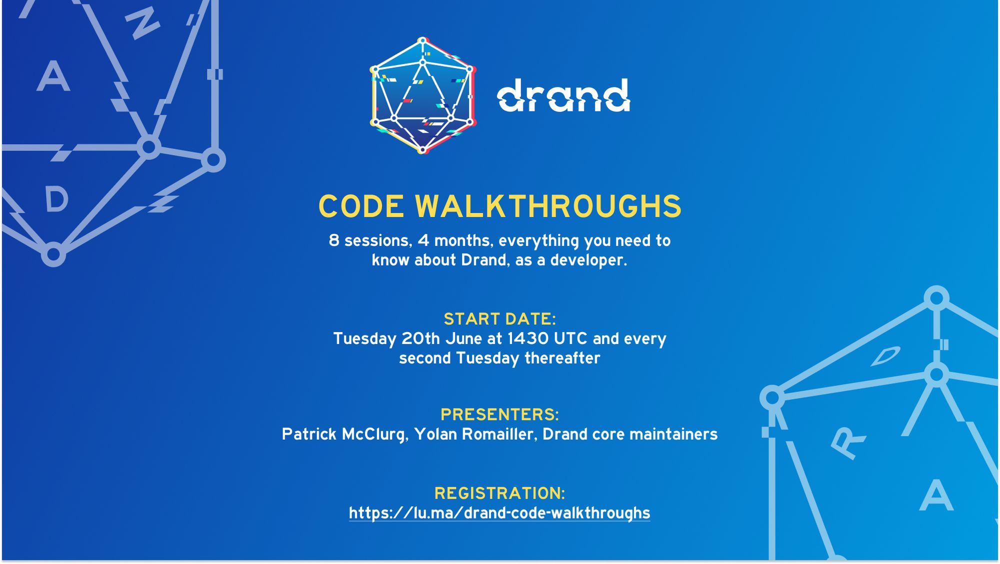

## What, where and when

The drand community and developer base is expanding rapidly. drand usage is gaining momentum with many applications using it to draw randomness for their systems. While our [slack workspace](https://join.slack.com/t/drandworkspace/shared_invite/zt-19u4rf6if-bf7lxIvF2zYn4~TrBwfkiA) is a great place to interact with other developers and the drand core maintainers, code walkthroughs are even better if one wants to gain a holistic view of the system, become familiar with nitty gritty details, and ask questions in real time.

With those benefits in mind, we have designed and will be running a series of virtual code walkthroughs on the drand codebase. The series consists of eight (8) sessions, taking place **every other Tuesday at 1430 UTC, starting on the 20th of June**. Each session is scheduled to last approximately 45mins with 30mins for Q&A and pair programming assistance.

## Registration

Registrations are handled through Luma. Any modifications or updates to the schedule or topics will be reflected on the Luma event page, so the best way to be kept up-to-date is to register for the event series.

Luma registration page: [https://lu.ma/drand-code-walkthroughs](https://lu.ma/drand-code-walkthroughs)

## Sessions in a nutshell

The topics and brief descriptions of the code walkthrough sessions are listed below. Note that both topics and dates are subject to change, especially given that the series is scheduled to run through the summer period with several events taking place. The best way to be kept up-to-date is to register through the above Luma link and join our drand slack workspace.

### **Session 1: “What is drand and how to use its CLI and clients”**

- **Dates:** Tuesday, **20th June 2023**, 1430 UTC
- **Description:** We will explain what the drand binary is, what it does and run through all of the CLI commands and related parameters to explain how to start a node as an operator and how to sync and follow other nodes. We will also run a Distributed Key Generation (DKG), perhaps the most central part of setting up a drand network.  
In this session we will not go through the DKG code, which is subject to another session.
Finally we will do a walkthrough of the drand client libraries. There are currently two drand libraries (in Go and in JS), which we will use to consume drand randomness.

### **Session 2: “What is a drand beacon? How is it created?”**

- **Dates:** Tuesday, **4th July 2023**, 1430 UTC
- **Description:** This session will focus on the randomness beacons produced by the drand network. We will explain the different representations of a beacon, as well as the beacon model followed by the drand mainnet. We will also dive into the details of why drand randomness is “verifiable” and how to derive randomness from the signature. drand is based on “threshold cryptography”, which, in practice, means that every node is producing a “partial” of the final signature. In this session, we will explain how partials are aggregated to produce the final randomness beacon.

### **Session 3: “drand Cryptographic Primitives”**

- **Dates:** Tuesday, **18th July 2023**, 1430 UTC
- **Description:** Cryptography is at the heart of drand. In this session, we will dive into the cryptographic primitives on which drand is based on. We will explain and showcase keypairs and distributed keys, the vault and the kyber library.

### **Session 4: “drand’s Distributed Key Generation (DKG)”**

- **Dates:** Tuesday, **1st August 2023**, 1430 UTC
- **Description:** Distributed Key Generation is the most central part of the drand network and threshold cryptography more in general. In this session, we will dive into the details of basic concepts, such as the Shamir secret sharing, Pedersen DKG, the “group file” and their implementation. We will also go through the lifecycle of a DKG event, relevant security considerations and the difference between “initial sharing” vs “resharing”.

### **Session 5: “The different layers of the drand system: from the daemon and the beacon process to storage/sync manager and the client”**

- **Dates:** Tuesday, **15th August 2023**, 1430 UTC
- **Description:** At a high level, drand comes as one coherent system. However, it is composed of several subcomponents that are distinct and play a particular role in the operation of the overall system. In this session, we’re going to put puzzle pieces from previous sessions together, define the taxonomy of the components, specify where does one stop and the other start and how they communicate and interoperate with one another.

### **Session 6: “drand’s Networking Stack & Monitoring Infra”**

- **Dates:** Tuesday, **29th August 2023**, 1430 UTC
- **Description:** As a distributed, Internet-based system, drand has a number of networking components to distribute randomness beacons across the drand network nodes and make beacons available to its users. In this session we will go through the network-layer protocols used by drand and will also cover the monitoring tools, metrics and infrastructure that we have in place in order to guarantee smooth operation and identify concerning situations before they become serious incidents.

### **Session 7: “drand’s Storage & Sync Functionality”**

- **Dates:** Tuesday, **12th September 2023**, 1430 UTC
- **Description:** drand beacons are not only valuable at the time they’re produced, but also well after their generation for applications that want to use or verify past beacons. As such, storage of beacons is an important functionality that all nodes in the network should support. In this session, we’ll go through the different types of storage backends. We will also cover the “sync” functionality, i.e., the case when a new node (re-)joins the network and needs to sync the history of beacons.

### **Session 8: “Client Libraries Deep Dive”**

- **Dates:** Tuesday, **26th September 2023**, 1430 UTC
- **Description:** In this final session, we will walk through the code of the client libraries in detail. We will also go through examples of using these libraries in practical use-cases to showcase their workflows. In addition, we will dive into the timelock encryption libraries and their code.

## Looking forward

We’re looking forward to an enlightening series of sessions. Please share your thoughts and feedback by joining the drand slack workspace [invitation link](https://join.slack.com/t/drandworkspace/shared_invite/zt-19u4rf6if-bf7lxIvF2zYn4~TrBwfkiA)] and posting questions in the `#code-walkthroughs` channel. Requests for extra topics are more than welcome. The League of Entropy can also be reached through email at: `leagueofentropy [ at ] googlegroups.com`.

Finally, don't forget to **register for free** to our code walkthroughs on our [registration page](https://lu.ma/drand-code-walkthroughs), see you there!
