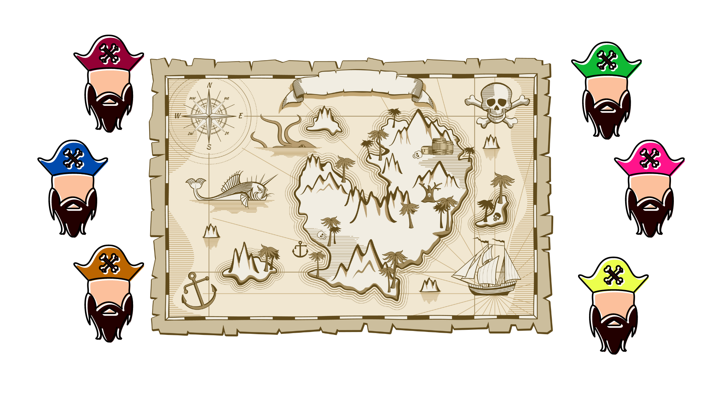
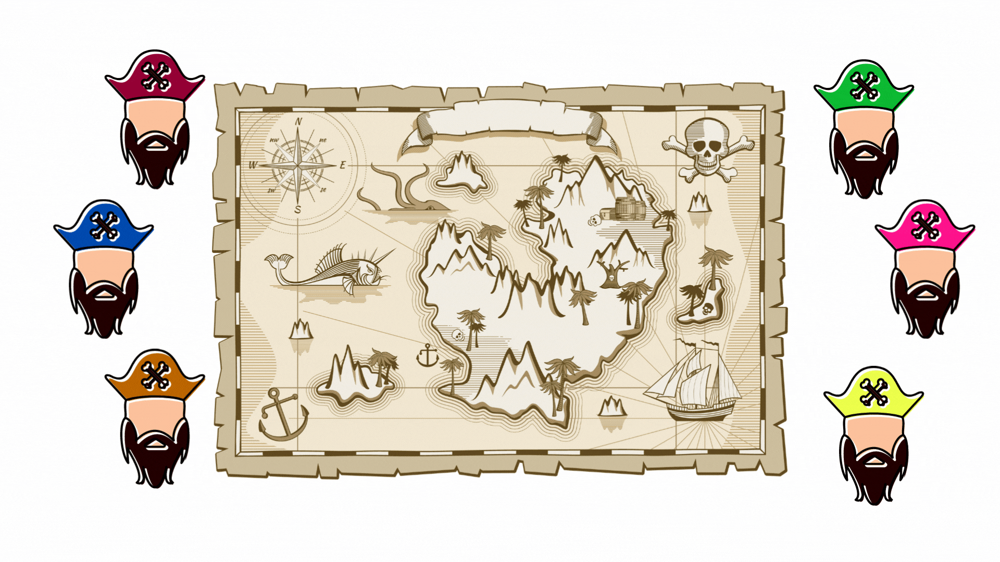

# Treasure Hunting Together: An Exploration of the Beauty of Distributed Key Generation Algorithms

Inspired by the work of [Rosario Gennaro](https://www.google.com/url?sa=t&rct=j&q=&esrc=s&source=web&cd=&cad=rja&uact=8&ved=2ahUKEwiToZ_D15iBAxU7QkEAHfWfAjIQFnoECA8QAQ&url=https%3A%2F%2Fdspace.mit.edu%2Fbitstream%2Fhandle%2F1721.1%2F11014%2F35957538-MIT.pdf%3Fsequence%3D2&usg=AOvVaw0L2voltxQPmSz27PD5zp6o&opi=89978449), [Johannes Blömer](https://link.springer.com/chapter/10.1007/978-3-642-15328-0_17) and 

> You can always trust the untrustworthy because you can always trust that 
they will be untrustworthy. It’s the trustworthy you can’t trust.
> 
> 
> – Captain Jack Sparrow
> 

If you're familiar with "Pirates of the Caribbean", you'll remember how tricky pirates can be. But if you have truly delved deep into pirate lore, you will definitely know that you should never trust a pirate.

## Scenario:

Imagine you're at a pirate gathering in the heart of the Caribbean. Captain Jack Sparrow has just discovered information on the most magnificent treasure ever known. However, he overhears whispers that other pirates are also on the trail.

To improve his chances, the crafty Sparrow creates a team of those pirates. At their first meeting, the pirates decide to combine their own clues to create the greatest possible treasure map. Jack, as the leader, is entrusted with this critical responsibility. But, before embarking on their expedition, they know the significance of thorough planning. Here is where a big dilemma arises: how can they ensure no single pirate betrays the rest and goes after the treasure alone?

One pirate proposes that Jack creates a copy of the map for each member. But trust is a rare commodity among pirates. Instead, Sparrow devises a cunning plan: he divides the map into pieces, giving each pirate a fragment. This ensures that the treasure can only be located when enough of the pieces are together, making each piece of the puzzle indispensable.

Now, imagine if this was not just a tale of sea and books. This story of divided maps and collective trust mirrors the amazing world of Distributed Key Generation (DKG) algorithms. Much like the fragmented map, a DKG algorithm breaks down a secret key into multiple shards. Only by combining a certain number of these shards can one unlock the information they protect.

Here's where it gets even more fascinating: in the world of DKG, even if one or two pieces are lost, the map can still be unlocked as long as a predetermined minimum number of fragments are combined. It’s like ensuring that even if one of the pirates gets lost at sea, or has been eaten by a shark the rest can still enjoy the treasure. DKG is a powerful cryptographic technique used in today's tech landscape, ensuring security in decentralized systems. This a wonderful world, where trust and cryptography coalesce in perfect harmony.

## The trick behind, Secret Sharing:

Secret sharing is the fundamental concept behind the construction of DKGs. We can see it as a magic trick that enables multiple participants to split a secret key or a secret message into several parts called "shares." The unique property of this method is that only a predetermined number of these shares (the threshold) can reconstruct the original secret, while any number less than this threshold yields no information about the secret. This mechanism ensures that even if some of the shares fall into the wrong hands, the secret remains safe unless the threshold is met.

The most famous secret-sharing scheme was introduced by Adi Shamir in 1979 and is known as Shamir’s Secret Sharing Scheme. The idea behind this involves polynomial interpolation and more specifically [Lagrange Interpolation](https://en.wikipedia.org/wiki/Lagrange_polynomial). (Mathematics 😞)  

In a nutshell: 

1. For a given secret 's', a polynomial 'φ' of degree 't'-1, where t is the threshold, is chosen so that the constant term of this polynomial, the value φ(0) in other words, is the secret.
2. Then each participant gets a share, which is a point on this polynomial.
3. In order to reconstruct the polynomial, and reveal the secret we need t participants to be involved. Otherwise, the secret cannot be revealed.

The above works under the context that we have a certain entity, named the Dealer, who is responsible for the sharing. However, assuming that the dealer is an honest entity is not a wise assumption. The dealer still knows the secret and the polynomial, and thus becomes a single point of failure. 

# DKGs:

As previously outlined, secret-sharing methods rely on a single dealer who is privy to the secret, posing a potential security risk. This vulnerability can be addressed by Distributed Key Generation (DKG), which allows each participant to contribute equally (⚖️) to the secret-sharing process. 

To demonstrate this, let’s go back to our pirate example. 

Let’s say that we have pirates A, B C, and we cannot forget Jack. We can say now that the secret is the actual gold of the treasure box, and the box is protected with a secret code - the key. The distribution now involves all four of them contributing to the randomness of the key. 

**🏴‍☠️ First Step:** Each of the pirates (Pirates A, B, C, and Jack) agrees to jointly create a secret key to a treasure box. But none of them should have the complete key on their own.

**🏴‍☠️ Generation:** Jack creates a polynomial of a degree t and distributes shares to the other pirates including himself. A does the same, and B and C follow too.

That means that at the end, each pirate will have four shares created including his/her own.

🙍🏾Jack : {s_Jack, s_A, s_B, s_C}           🙍🏾‍♂️A: { s_A, s_Jack, s_B, s_C}

🙍🏾‍♀️B: { s_B, s_Jack, s_A, s_C}              🥷🏾C: {s_C, s_Jack, s_A, s_B}

**🏴‍☠️ Sharing:** As soon as the above is complete, each pirate distributes their shares to the other pirates. So, at the end of this, each pirate  should have one share from each other pirates, including themselves. Therefore, for example, Jack must have 4 shares, 3 from A, B, C and 1 from his own.

**🏴‍☠️**  The next step of the process, is that each pirate combines the received shares to create their final secret share for the construction of the key. Therefore, now 4 new individual aggregate shares will be 
constructed that when interpolated together reveal the polynomial.

**🏴‍☠️ Reconstruction:** Based on a given threshold, the pirates can reconstruct the secret. What this eventually means is that a subset of pirates more or equal to a specific threshold 't' can combine their final aggregated shares to reconstruct the polynomial and thus the secret.

## Decentralization:

The beauty of DKG is its decentralized nature. Since every pirate contributes equally to the randomness of the key, it's incredibly difficult for an outside adversary to determine the full secret key without access to the requisite number of shares. Moreover, the process guarantees that even if a pirate tries to cheat and distribute false shares they can be detected and potentially excluded from the protocol.

Overall, DKG algorithms are an amazing research area and they can be used securely in a variety of cryptographic operations, like generating secret keys for signing or validating. Furthermore, by allowing DKG to take place,  the power is spread among the participants, reducing the risk of a single point of failure and increasing the overall security of the network.

# Drand’s DKG Approach:

[Drand](https://drand.love/) incorporates [Pedersen's DKG scheme](https://www.cs.cornell.edu/courses/cs754/2001fa/129.PDF), an advanced framework originally devised by Torben Pryds Pedersen. This method ingeniously builds upon multiple instances of [Feldman's Verifiable Secret Sharing (VSS)](https://www.cs.umd.edu/~gasarch/TOPICS/secretsharing/feldmanVSS.pdf), enhancing them with added verification procedures to further secure the protocol.

From a high-level perspective, the protocol can be divided into three distinct phases:

1. **Share Distribution:**  Each participant generates a random secret and distributes it to the other participants using Feldman's VSS. Then, each party sends a unique share to every other member and publicly broadcasts a list of commitments. A commitment can be seen as a digital analogue of an envelope ✉️ that has been sealed. The envelope provided hiding until it is opened and binding as it is sealed, exactly like a commitment. 

2. **Verification Phase:** Each participant verifies the received shares they have received from other participants. If a participant identifies an incorrect or invalid share, they issue a public complaint against the sender. The accused party must then either correct the share or risk being deemed an unreliable dealer.
3. **Finalization Phase:** During the final phase, all verified shares from every participant are aggregated. However, any participant found to be unreliable or invalid during the verification stage is excluded from this aggregation

********************************************Metrics of the protocol:********************************************

| Network Model | Fault tolerance | Adaptive adversary | Discrete log key | CommunicationComplexity | Comp. Complexity | Round Complexity |
| --- | --- | --- | --- | --- | --- | --- |
| Sync. | 1/2 | No | ✅ | $O(n\mathcal{B}(\kappa t))$ | $O(n^2)$ | $O(R)$ |

Where $t$ is the threshold of malicious nodes, $\mathcal{B}(\kappa)$ represents the communication cost of Byzantine Broadcast and $R$ its round complexity. As presented in the paper by [Das et al.](https://eprint.iacr.org/2021/1591.pdf)

### Resharing ###
An operation of DKG, important for Drand is resharing. Resharing allows for the addition and removal of new participants, in the node while maintaining the distributed key. In this case,  we have an initial group of nodes labelled as A, which has already executed the DKG protocol and possesses portions of a distributed private. This group aims to redistribute their portions  to another set of nodes, labelled as B. The B group nodes initially have no shares but are aware of the long-term public keys of the A group nodes. The goal is that after resharing, the B group nodes can utilize their updated shares for randomness generation. However, the A group nodes will be excluded from generating randomness alongside the B group nodes. 

More information about the resharing of Drand: [Resharing](https://drand.love/docs/specification/#setup-phase)

### Implementation: The Kyber Library 💻:

Drand's implementation (DKG) for its distributed randomness beacon is executed using the Kyber Library, a specialized cryptographic library written in Golang, also commonly referred to as the Go programming language. The Kyber Library as forked by Drand provides a robust set of cryptographic primitives and utilities, enabling the highly secure and efficient deployment of Pedersen's DKG scheme within this framework.

Check this out:

[GitHub - drand/drand: 🎲 A Distributed Randomness Beacon Daemon - Go implementation](https://github.com/drand/drand)

[GitHub - drand/kyber: Advanced crypto library for the Go language](https://github.com/drand/kyber)

### Sinking or Swimming: A Deep Dive into Pedersen's Security 🤿 :

There has been considerable debate and, in some quarters, a level of confusion regarding the security aspects of Pedersen's DKG. To provide a clearer understanding of the evolving perspectives on its security, it's beneficial to delve into a brief timeline that outlines key milestones in the research focused on this framework.

😃 🏊🏾‍♂️ **1991: Pedersen**

In the early 90s, Pedersen initially introduced the DKG scheme. The security in the initial scheme lies in the security of the Joint-Feldman Protocol for verifiable secret sharing during the secret-sharing process

🙄⚓**2006**: **[Gennaro et al.](https://link.springer.com/article/10.1007/s00145-006-0347-3)** 

Gennaro et al. took the Joint-Feldman protocol as described by Pedersen and they showed that a potential adversary can craft their contribution in a way that can influence the group public key such that is not uniformly random. Therefore, the adversary can take the advantage to compromise two of the participants and gain information about the private key, which means it leaks information about the secret. As a result, this is a sinking phase for Pedersen, as it shows that it cannot be used as a secure DKG protocol. But future research always finds ways to amaze us ...

😃 🏊🏾‍♂️ **2007**:  **[Rabin et al.](https://link.springer.com/content/pdf/10.1007/3-540-48910-X_21.pdf)** 

In this 2007 study, Rabin et al. provided a series of security proofs showing that Feldman's (VSS) was susceptible to malicious inputs in Pedersen's (DKG). However, the same article also notes in Section 5 that Joint-Feldman (JF-DKG) has a beneficial attribute: it prevents any adversary from producing an output that allows the computation of its discrete logarithm. This feature is sufficiently robust to enable the construction of secure threshold signature schemes. Therefore, it makes Pedersen’s initial DKG sufficient for threshold signing. 

😃 🏊🏾‍♂️ **2021**: **[Gurkan et al](https://eprint.iacr.org/2021/005).**

In a more recent study, Gurkan et al. showed that Pedersen's DKG is a secure way to handle rekeyable encryption schemes, signature schemes, and VUF functions. Specifically, they provided formal proof that states using JF-DKG is secure, preventing an adversary from forging a signature by participating in the actual DKG protocol. This is relevant as Drand utilizes the BLS signatures that have been proven secure, and allow efficiency without additional rounds. 

# ***The Future: Asynchronous DKG Algorithms***

Looking ahead, one exciting development in the world of DKG is the adoption of asynchronous algorithms. Traditional DKG protocols often rely on synchronous communication assumptions, where participants operate in rounds, waiting until the end of each round before proceeding.

The adoption of asynchronous DKG algorithms aims to enhance the efficiency and resilience of decentralized systems, such as blockchain networks, which are becoming increasingly popular. By improving the underlying key generation processes, these algorithms are paving the way for more secure, reliable, and scalable decentralized systems.

The latest DKG protocol presented in the literature is [Bingo](https://eprint.iacr.org/2022/1759.pdf) 🀞🀞:

- Interesting components adjusted in Bingo:
    - [Bivariate Polynomials](https://mathworld.wolfram.com/BivariatePolynomial.html) (Allows to achieve an f-sharing to achieve a packed VSS)
    - [KZG Commitments](https://dankradfeist.de/ethereum/2020/06/16/kate-polynomial-commitments.html) (For the creation of Bivariate Polynomial Commitment Scheme to obtain
      adaptive security )
    - [Bilinear Pairings](https://en.wikipedia.org/wiki/Pairing-based_cryptography) (As required by the KZG commitments) 
    - Utilization in asynchronous settings.
    
- Advantages in Security:
    - Adaptive Adversaries:  Within the domain of (DKG) security, the primary focus has often been on passive adversaries—those that can merely observe information. However, Bingo marks a pivotal advancement as it is the first (ADKG) protocol to successfully prove security against adaptive adversaries, all while retaining the same asymptotic complexity as an ADKG protocol secure against non-adaptive threats.
      - But what is an adaptive adversary?
        An adaptive adversary represents a malicious entity trying to corrupt nodes with the advantage that can adapt to the environment and responses from the environment as part of the attack.
        

Distributed Key Generation (DKG) algorithms are a rich field with unlimited possibilities and innovations. The progress made in enhancing security and scalability, particularly against adaptive adversaries, is a testament to the continuous progress in this area. As we explore this fascinating intersection of cryptography, distributed systems, and security, it becomes increasingly clear that we are part of a wonderful world that is continuously evolving.

The exhilarating pace of research and discovery in DKG only deepens our anticipation for the groundbreaking developments that the future is bound to bring.
