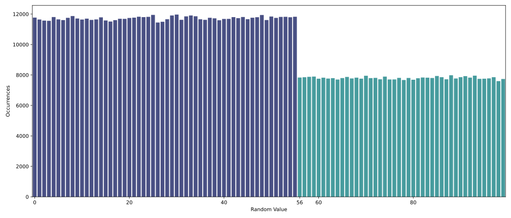

# On-Chain Randomness Gotchas

When building smart contracts that rely on random values, relying on proper randomness is fundamental, especially in applications like lotteries, random NFT allocations (with random NFT rarities), and more. Notwithstanding, generating and using randomness on-chain can be tricky. In this blog post, we reflect on why proper (unpredictable and unbiasable) randomness is needed, the challenges of achieving it, and common pitfalls to avoid when writing smart contracts that consume random values.

Randomness on-chain should be **unpredictable** and **unbiasable**. This means that no one, including miners or validators, should be able to manipulate or predict the outcome. Achieving a balance between unpredictability and efficiency is challenging, as many methods can be vulnerable to manipulation. 

## Why Do We Need Randomness in Smart Contracts?

Randomness is key for various functions in decentralised applications (dApps), including the following examples:

- **Selecting a random subset** of participants from a larger group, such as an array `[1, 2, 3, 4]`, involves considering all possible subsets rather than just contiguous subarrays. For an array of size `n`, the total number of *non-empty* subsets is $2^n−1$, which accounts for all combinations of elements, including single elements `(1)`, pairs `(1, 2)`, `(1, 3)`, triples `(1, 2, 3)`, and so on. For `[1, 2, 3, 4]`, this results in 15 subsets. If the order of the selection matters, permutations are used instead, calculated as $P(n,k)=/frac{n!}{(n−k)!}$, where `k` is the number of elements chosen. Understanding whether to use subsets, combinations, or permutations ensures a fair and appropriate method for selecting winners or participants randomly from a group.
- **Shuffling arrays**, i.e., distributing items in a randomised order.
- **Minting random NFTs** where different rarities are assigned randomly.
- **On-chain raffles** where winners are picked at random from a list.
- **Rolling a dice** and executing some logic based on the outcome of the dice roll.

## On-Chain Randomness Gotchas to Watch Out For

When implementing randomness in smart contracts, several pitfalls can affect the randomness quality or lead to vulnerabilities. Let's explore a few of them together.

### 1. **Entropy Reduction**

- **Problem**: Extracting smaller segments (like `uint8` or `uint32`) from a `uint256` random value doesn’t inherently reduce randomness but limits the maximum entropy to the size of the segment. Entropy, as a measure of unpredictability, is directly tied to the number of bits used. When you only use 8 bits out of a 256-bit random value, the resulting value will have at most 8 bits of entropy, which is sufficient for generating an 8-bit number but doesn’t utilise the full potential of the 256-bit value.
- **Example**: For scenarios requiring an 8-bit random number (a value between 0 and 255), using only 8 bits from the 256-bit value is appropriate and does not reduce the randomness or unpredictability for that specific use case. However, if the intention is to maximise randomness for larger ranges or use the value for purposes requiring high entropy, discarding the remaining bits could be wasteful or insufficient.
- **Solution**: Use the Right Amount of Entropy for your Use Case. If you need an 8-bit random number, extract precisely 8 bits. There’s no benefit to using more bits than required in this scenario, as the entropy of an 8-bit integer is inherently capped at 8 bits.
    
    Avoid Wastefulness. When many small numbers are needed, make full use of the 256-bit random value. For example, instead of discarding unused bits, consider splitting the 256-bit value into 32 smaller 8-bit integers for other parts of your application where randomness is needed.
    
    Understand Entropy Needs. Evaluate how much entropy your application requires and tailor your approach accordingly. Discarding excess bits is fine when they aren't needed but could be detrimental and lead to bias if greater unpredictability is required for security purposes.
    

### 2. **Modulo Bias**

- **Problem**: When you use the modulo operation to constrain a random number to a specific range, there is a risk of uneven distribution.
- **Example**: Using `randomValue % 100` could lead to some numbers being more likely than others if the max `randomValue` is not evenly divisible by 100. In the following bar plot, we generated a million random integers with the above formula and an 8-bit `randomValue`, i.e., a value between 0 and 255 inclusive.
    
    
    
    Clearly, we can see that the first 55 values are more likely to occur than the rest. This modulo bias is a result of the modular reduction. This can be explained intuitively by looking at how random values are mapped into the $[0, 99]$ range. When `randomValue` is equal to 0, 100, or 200, the modular reduction maps it into 0. In other words, there are three distinct values that can be mapped into 0. The same observation can be made for the first 56th values. However, for the rest, there are only two distinct values. Let’s look at which values can be mapped into 60: there is only 60, 160. `randomValue` cannot be 260 since we assume an 8-bit random value. Hence, only two values can be mapped into 60. This is the source of the non-uniform distribution.
    
- **Solution**: Use rejection sampling or other techniques to avoid bias and ensure a uniform distribution. If you are intent on using the modulo operation to sample your integers, make sure you are starting from values that are at least 128 bits larger than the value you are reducing to, thus causing the bias to be negligible.

### 3. **Predictable Sources of Randomness**

- **Problem**: Using predictable sources like `block.timestamp` or `blockhash` can lead to outcomes that are easy to predict or manipulate.
- **Example**: In the Solidity smart contract function below, if an attacker knows the block timestamp and their own address (which they do), they can predict the hash output for any given block, making the randomness easily guessable. Furthermore while this might look like it’s suffering from modulo bias, reducing a 256 bit value to a <8 bit integer is actually fine as the bias will be negligible.

```solidity
function drawLottery() public returns (uint8) {
    uint256 randomValue = uint256(
	    keccak256(abi.encodePacked(block.timestamp, msg.sender))
	  );
	  // Random number between 0 and 99
    return uint8(randomValue % 100); 
}
```

- **Solution**: Utilise better, unpredictable yet verifiable randomness sources like [**drand**](https://drand.love).

### 4. **Hash Collisions**

- **Problem**: Using a hash function like `keccak256` with poor or predictable inputs can lead to hash collisions, where two different sets of input values produce the same hash. This compromises the uniqueness and reliability of the hash, making it exploitable in scenarios requiring high entropy, such as generating unique IDs or random numbers. Additionally, predictable inputs can lead to reduced randomness, where the output of the hash function becomes less unpredictable than expected. This can create vulnerabilities in systems that rely on randomness for security or fairness, such as lotteries, token distributions, or cryptographic proofs.
- **Example:** Consider a contract that uses `keccak256(abi.encodePacked(block.timestamp))` to generate a random value. Since `block.timestamp` can be influenced by miners within a small range or predicted by an attacker observing transaction patterns, the resulting hash becomes highly predictable. This allows attackers to exploit the system by determining favourable conditions to participate or manipulate outcomes.
- **Solution**: To mitigate these issues, use highly unpredictable and diverse inputs for hashing to maximise entropy. For example, instead of hashing a single predictable value like `block.timestamp`, combine it with less predictable sources such as the sender's address (`msg.sender`), a unique transaction identifier, or even cryptographic nonces.
    - **Combine Multiple Sources**: Rely on unpredictable input sources or reliable off-chain randomness oracles like [**drand**](https://drand.love). This reduces the likelihood of predictability and collisions.
    - **Test for Predictability**: Simulate different input scenarios to identify any potential vulnerabilities or patterns in hash outputs. For instance, ensure that no adversary can influence or predict the resulting hash values.
    - **Avoid Encoding Pitfalls**: Use proper encoding methods like `abi.encode` instead of `abi.encodePacked` to avoid unintended hash collisions from input concatenation.
        
        ```solidity
        keccak256(abi.encodePacked("hello", "world")); // Hash of tightly packed "helloworld"
        keccak256(abi.encodePacked("hellow", "orld")); // Also the hash of tightly packed "helloworld"
        ```
        
        In the code snippet above, two different input pairs (`("hello", "world")` and `("hellow", "orld")`) produce the same encoded string (`"helloworld"`) and, therefore, the same hash. This collision can undermine the integrity of the hashing process if used to verify uniqueness or randomness.
        
        On the other hand, by using `abi.encode`, the type and length of each input are preserved, ensuring that different inputs produce different hashes, even if their concatenated representations are the same. For example:
        
        ```solidity
        keccak256(abi.encode("hello", "world"));  // Hash includes type and padding
        keccak256(abi.encode("hellow", "orld"));  // Hash includes type and padding, different result
        ```
        
        Here, the two hashes will be different because `abi.encode` encodes the type and structure of the inputs distinctly.
        

### 5. **Composition Attacks**

- **Problem**: If a function using randomness is public, attackers could manipulate transactions to guarantee they always win.
- **Example**: Imagine we have a Solidity smart contract function that lets users flip a coin.

```solidity
function flipCoin() public returns (bool) {
    // Unpredictable and unbiasable random value
    uint256 randomValue; 
    // 50/50 chance
    bool win = randomValue % 2 == 0; 
    if (win) {
        // Send reward to the player
        payable(msg.sender).transfer(1 ether);
    }
    return win;
}
```

Since this `flipCoin()` function is public, an attacker could exploit it by calling it repeatedly from within another smart contract function. This approach allows them to ensure they only proceed when they win by programmatically controlling the interaction and validating outcomes before completing the blockchain transaction.

For example, they could write a smart contract function that:

1. Calls `flipCoin()` in a transaction.
2. If the result is a win, the transaction is confirmed.
3. If the result is a loss, the transaction is reverted or discarded before it’s finalised on the blockchain.
- **Solution**: Avoid making randomness-based functions public or callable only under controlled conditions, like within a transaction sequence that cannot be manipulated.

### 6. **Gas-Based Attacks**

- **Problem**: If a losing outcome in a contract consumes more gas than a winning one, attackers can force transactions to abort when they lose by exploiting the gas limit by setting a gas limit just enough to execute the transaction if they win but not enough if they lose.
- **Example**: In the Solidity smart contract function below, a winning transaction will transfer the prize to the winner but a losing transaction might run out of gas during the `recordLoss` function call as the losing outcome executes more logic or does more work.

```solidity
function flipCoin() public returns (bool) {
    // Unpreditable and unbiasable random value
    uint256 randomValue; 
    // 50/50 chance
    bool win = randomValue % 2 == 0; 

    if (win) {
        // Winner gets a prize
        payable(msg.sender).transfer(1 ether);
    } else {
        // Losing outcome does more work
        // and uses extra gas
        recordLoss(msg.sender); 
        emit LossRecorded(msg.sender);
    }

    return win;
}
```

- **Solution**: Ensure that the gas usage is consistent regardless of the outcome.

## Conclusion

Randomness is very important for trust in blockchain-based systems, enabling fair games, secure protocols, and robust applications. However, poorly implemented randomness techniques can introduce vulnerabilities, exposing systems to exploitation. Addressing these gaps is critical for ensuring the integrity and reliability of decentralised technologies.

**The League of Entropy and [drand](https://drand.love)** offer a robust solution using threshold cryptography off-chain, whereby nodes collaborate to produce publicly verifiable and unpredictable random values. The random values can then be used on a blockchain to fulfil requests. No single node can control or predict the outcome and the random values are generated at regular intervals without any reuse.

By understanding the associated risks with pseudo-randomness, hash collisions, modulo bias and predictable inputs, developers can design solutions that benefit from enhanced security and fairness. Leveraging best practices such as incorporating high-entropy sources like drand beacons, using verifiable randomness oracles, and conducting rigorous audits is vital to creating systems that users can trust.