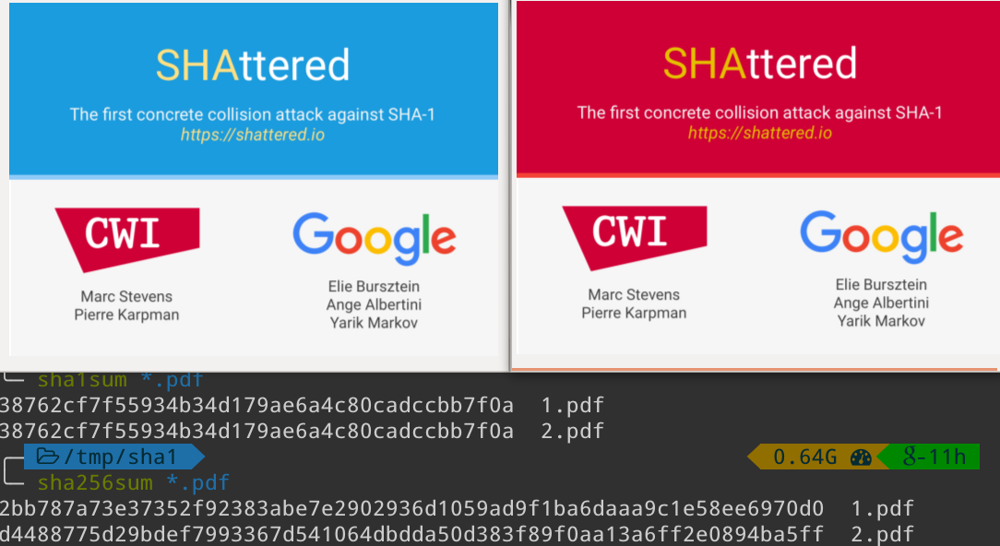

First things first, if you’re still using the SHA-1 hashing algorithm in 2025, you are probably doing something wrong, or hopefully working on a very expensive Capture-the-flag (CTF) challenge. Exactly how expensive is what we’ll try to answer in today’s blog post. 

Let’s introduce briefly SHA-1: it is a hash function created in the early 90s and standardized by NIST in 1995. A hash function is a function that takes an arbitrary input and returns a fixed size digest (”a hash”), in SHA-1's case it has a 160 bit output. While there are many uses of hash functions in modern computer science, be it hash-tables, integrity checks, or blockchains, it is important to know that the so-called “cryptographic hash functions” have more stringent properties than other hash functions, most notably (as per FIPS definitions):

1. Collision resistance: It is computationally infeasible to find any two distinct inputs that map to the same output.
2. Preimage resistance: Given a randomly chosen target output, it is computationally infeasible to find any input that maps to that output. (This is also called the one-way property.)
3. Second preimage resistance: Given one input value, it is computationally infeasible to find a second (distinct) input value that maps to the same output as the first value.

While it was initially believed that SHA-1 was a secure cryptographic hash function, attacks against its collision resistance have been known since 2005, while its proposed replacements, the SHA-2 hash family, were standardized in 2002 and are still believed to be resistant to collision attacks.

Practical SHA-1 collisions have been public since 2017. The first known one was a collaboration between CWI and Google, where the cryptanalytic attacks that Marc Stevens devised in 2012 were further refined and implemented in practice by leveraging Google’s massive computing capabilities in order to find a first collision. They demonstrated it in their SHAttered work by creating two different PDFs with the same SHA-1 hashes, as shown on the below image (from [their website](https://shattered.io/)):



At the time, this practical collision was instrumental in triggering the move towards more secure and robust hash functions, acting as a forcing factor for many software engineers to finally take  time to worry about moving away from SHA-1 (whose replacement was recommended since 2010, and whose support in TLS certificates was announced in 2014 to be phased out by 2017). At the time, the alternatives to SHA-1 included for example SHA-256, Blake2 or SHA-3.

“How complex is it to find a SHA-1 collision?” is the first question we need to answer before proceeding with today’s main question, and according to the 2017 [https://shattered.io/](https://shattered.io/) website and paper:

```
This attack required over 9,223,372,036,854,775,808 SHA1 computations [9×10^18]. This took the equivalent processing power as 6,500 years of single-CPU computations and 110 years of single-GPU computations.
```

And that’s exactly what it took them in 2017 to find such a collision: thousands of CPU years of computation to find a collision, but thankfully parallelized on the massive infrastructure they could rely on.

Since then, attacks only got better and a more recent "[SHA-1 is a Shambles](https://sha-mbles.github.io/)" work came out in 2020, further improving the SHAttered attack. In that one, they estimated the cost of their attack to be only $2^{61.6}=3.5\cdot 10^{18}$ SHA-1 computations vs. the $2^{63}$ computations in the initial SHAttered attack, a significant improvement. In that same paper, they also described a *chosen-prefix* collision with a complexity of just $2^{63.4}$ rather than the previously known ones $2^{67.1}$, meaning such chosen-prefix attacks are now a practical threat. They demonstrated it in practice: performing roughly $2^{62.9}$ hashes, which at the time was ~107 GPU-years worth of computation, which cost them $75.6k in 2020. Interestingly, back then they said:

> we estimate that it should cost less than US$ 10k to generate a SHA-1 chosen-prefix collision by 2025.
> 

Well, time to check this out! How much does it cost in 2025 to find a SHA-1 collision in $2^{61.6}$ hashes and a chosen-prefix attack in $2^{63.4}$ operations?

As of 2025, according to recent Hashcat benchmarks (e.g. from [openbenchmarking](https://openbenchmarking.org/test/pts/hashcat)), modern Nvidia GPUs have become very good at computing SHA-1 hashes, as shown by these hash-rates:

```
Hash-Mode 100 (Hashcat)
    NVIDIA GeForce RTX 3090         ~22 GH/s  ($1499)
    NVIDIA GeForce RTX 4070 SUPER   ~22 GH/s  ($ 599)
    NVIDIA GeForce RTX 4080 Super   ~30 GH/s  ($ 999)
    NVIDIA GeForce RTX 4090         ~51 GH/s  ($1599)
    NVIDIA GeForce RTX 5090         ~68 GH/s  ($1999)
```

On the AMD side of things, their GPUs seems to perform in the same range while remaining at a comparable price:

```
Hash-Mode 100 (Hashcat)
	AMD Radeon RX 6800 XT     ~20 GH/s   ($ 649)
	AMD Radeon RX 6900 XT     ~23 GH/s   ($ 999)
	AMD Radeon RX 7900 XT     ~26 GH/s   ($ 899)
	AMD Radeon RX 7900 XTX    ~30 GH/s   ($ 999)
```

At the time of writing this, AMD is yet to release their latest and greatest GPUs, since the Radeon RX 9000 series is slated for launch in March 2025, over 14 months after the launch of the 7900 XTX. The launch prices are not necessarily representative since the GPU shortage in 2020 drove the price of the RTX 3090 at the time to almost \$2500, and the prices of the RTX 4090s directly surged to \$2500 upon launch in 2022… However, looking at the current retail prices of these GPUs, it appears that the best “hash per buck” one can hope for is a whooping 40 MH/\$ thanks to the recent price drop of the 7900 XT from \$899 to \$650. On the NVIDIA side, the RTX 4070 cards are surprisingly on equal footing with the newest RTX 5090 ones since they both are offering 32-34 MH/\$.

A direct application of the rule of 3 allows us to compute that with this kind of hash rates, we are able to find a SHA-1 collision in 

$\frac{2^{61.6} \text{H}}{68.9 \text{GH/s}} = 14081.4 \text{hours}$

with a single RTX 5090 GPU, which is just 1.61 GPU-years! Far from the 110 GPU-year it used to take in 2017… How about a chosen-prefix attack as was done in 2020, you might ask?

Well, we can compute it as well, it would take us

$\frac{2^{63.4} \text{H}}{68.9 \text{GH/s}} =  49034.2 \text{hours}$

using our brand new RTX 5090 GPU, which is roughly 5.6 GPU-years, also very far from the 107 GPU-year it took in 2020!

But here’s a trick with these kind of attacks: they parallelize really well! So we could just use more GPUs, maybe 8, and then we could get a SHA-1 collision in only 74 days… Actually just using 2 RTX 5090s would allow us to find a collision in 296 days, which would still be in 2025!

And that would come at a cost of ~\$3,998 for our 2 GPUs, plus 296 days of consuming 2 times 575 watts at a cost of \$0.18 per kWh (average cost in December 2024 in the USA), which is \$1,470 of electricity costs for running our GPUs until we find our collision. Therefore finding a SHA-1 collision “at home” in 2025 could cost us roughly \$5,468.

But let’s be honest, no one builds a GPU farm just to find a SHA-1 collision when one can just rent some beefy GPU instances… And funnily the on-going AI hype has led to a significant increase in options in the landscape of GPU rentals. For example, an instance of 8 beefy RTX 4090 GPUs with a hash rate of ~408GH/s can be rented for as little as \$3 per hour and no more than \$5.5 per hour… Having found 22 such instances, I could find a collision in less than 5 days at a cost of less than \$12,000! So yeah, still a bit too long and too expensive for a CTF challenge! 

Also note that this is not taking possible ASICs into account, unlike the 2021 paper "On The Cost of ASIC Hardware Crackers: A SHA-1 Case Study" which answers our question when assuming custom ASICs are an option:

> In particular, we remark that the chosen-prefix collisions for SHA-1 can be generated in under a minute, with an ASIC cluster that costs a few dozen Millions dollars. Such ability would allow an attacker to apply the SLOTH attack on TLS or SSH connections using SHA-1.
> 

Finally, if we take into account **supercomputers** or distributed compute networks such as the **Bitcoin network**, things aren't looking good: the Bitcoin network could do it in a fraction of a second, given its current hashrate of over 800M TH/s, or 800 Exahashes per second... (it used to be 200 just 2 years ago, and yeah, these are crazy numbers. The bitcoin network currently ~~wastes~~ uses enough computing power to compute over $2^{78.66}$ SHA-1 hashes in order to mine a single block in 10 minutes.) 

With such power, you’d expect to find hundreds of collisions every second! But that's not technically true since the Bitcoin's dedicated hardware is actually very specialized and is meant to compute SHA-256 hashes. As a side note, the way the Bitcoin network relies on double SHA-256 hashing for its Proof of Work algorithm doesn’t help when it comes to collisions: any collision $\operatorname{SHA256}(x)=\operatorname{SHA256}(y)$ will necessarily also be a collision for  $$\operatorname{SHA256}(\operatorname{SHA256}(x))=\operatorname{SHA256}(\operatorname{SHA256}(y)).$$

In a more realistic way, it would take less than a day to find a SHA-1 collision on a super-computer such as the one owned by the US Department of Energy's Oak Ridge National Laboratory (ORNL) named "Summit", and the fastest super-computer in the world, El Capitan, relies on a whopping 43,808 AMD MI300A GPUs, and each of these MI300A GPUs are able to pump at least 22GH/s (or $2^{34}$ H/s) SHA-1 computations (according to [some recent benchmarks](https://www.youtube.com/watch?v=D4aIl0tzILE)), meaning El Capitan can run $43808 \cdot 2^{34} \approx 2^{49}$ hashes per second on its GPUs, meaning it reaches the $2^{61.6}$ hashes required in roughly an hour! El Capitan however has an estimated cost of $600 million, so that might not be a cost-effective option…

Finally, looking back at the prediction we quoted earlier, can we really find a SHA-1 chosen-prefix collision for less than \$10,000 in 2025? Well, not if we want it to finish in 2025 and assume an electricity price of \$0.18 per kWh, and also not using rented GPUs. But if we purchase just 2 RTX 5090s at \$1999 each (let’s assume you’re not getting the fancy, expensive versions), and have them running for the 413 days it would take them to find a SHA-1 **chosen-prefix collision** for roughly \$5065 of electricity cost, then we could find one for less than \$10,000!   

Most remarkably, for the basic SHA-1 collision, we can see that in only 8 years, we're down from an attack costing ~110 GPU years to an attack costing ~8 GPU-years in 2020 (thanks to both theoretical improvements & newer GPUs) to less than 2 GPU years nowadays (thanks to newer, much faster GPUs). Funnily, this is roughly in line with what Moore’s law would have told us.

See you all next time, and keep hashing (just not with SHA-1)!
