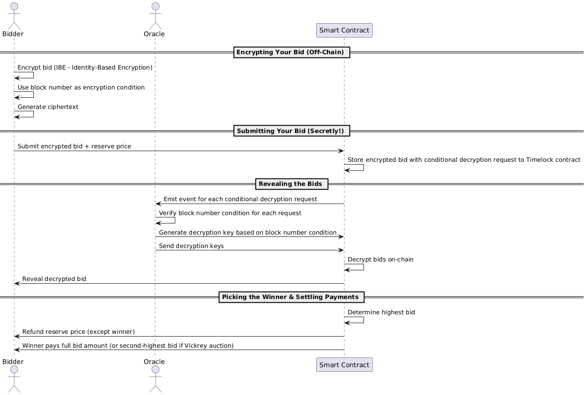

## 1. What We're Building & Why It's Cool

🔒 A **sealed-bid auction** is like a high-stakes guessing game where no one knows what anyone else is offering until the very end. Instead of shouting bids in a crowded room (like in a regular auction), everyone submits their bids **in secret**. Once the bidding phase is over, all bids are revealed, and the highest bidder wins.

### **Why does it matter?**

- 🎯 **No Last-Minute Sniping** – Since bids are secret, no one can wait until the last second to outbid someone else.
- ⚖️ **Fairer Competition** – Everyone bids based on what they think the item is worth, not just to beat the current highest bid.
- 🔐 **Privacy & Strategy** – In open auctions, bidders might adjust their offers based on others' bids. With sealed bids, it's all about **what you're actually willing to pay**.
- **🛡️ Censorship Resistance** – By publishing bids on-chain, we ensure that nobody has the power to censor bids.

⛓️ Imagine trying to do this on a public blockchain where all state is visible to everyone, and then consider the power of timelock encryption, which allows data to remain unreadable until a specified time, protecting sensitive information even in transparent systems—that means bids stay locked until the conditions for their automated decryption have been met. In this case, the condition is a block number in the future (the final one of the bidding phase of the auction), making sure everything is **provably fair and tamper-proof**.

Cool, right? **No bid sniping, no last-minute drama.**

By the end of the tutorial, you will have:

- 💻 A sealed-bid auction smart contract (written in Solidity) and deployed to the [Filecoin Calibration Test Network](https://docs.filecoin.io/networks/calibration).
- 🔧 A simple JavaScript code to interact with our smart contract, i.e., generate encrypted bids, place them on-chain, and watch them get decrypted at the auction end block number.

You will also get to meet [**blocklock-solidity**](https://github.com/randa-mu/blocklock-solidity) and [**blocklock-js**](https://github.com/randa-mu/blocklock-js), our Solidity and TypeScript libaries for on-chain timelock encryption (a.k.a conditional decryption).

## 2. Prerequisites

Before we dive in, make sure you have the following:

### **Basic Knowledge**

- Familiarity with **Solidity and JavaScript** (don’t worry—we’ll keep it straightforward).

### **Tools & Setup 🔧**

1. **Install [Node.js](https://nodejs.org/en/download) and [Yarn](https://classic.yarnpkg.com/lang/en/docs/install/#mac-stable)**
    
    Verify the installations with:
    
    ```bash
    $ node --version
    $ yarn --version
    ```
    
2. **Set Up Foundry** (for smart contract development, testing, and deployment)
    
    Install the Foundry toolchain following the installation steps in the [Foundry documentation](https://book.getfoundry.sh/getting-started/installation).
    
3. **Set Up an EVM-Based Wallet** (for the Filecoin Calibration testnet)
    - You’ll need an **EVM-compatible wallet** configured for the Filecoin Calibration testnet.
    - To cover transaction costs, request FIL test tokens from the [Filecoin faucet](https://docs.filecoin.io/smart-contracts/developing-contracts/get-test-tokens).
4. **Code Editor**
    - Any editor works, but we recommend [Visual Studio Code](https://code.visualstudio.com/) if you are a beginner.

## 3. How the Sealed-Bid Auction Works

The auction runs in **four phases**:

1. 🔒 **Encrypting Your Bid (Off-Chain)** – Before submitting a bid, each bidder encrypts their bid amount off-chain. This generates a **ciphertext** (fancy word for an encrypted bid) that they'll submit to the smart contract.
2. 💰 **Submitting Your Bid** **(On-Chain)** – Bidders send their encrypted bids to the smart contract, keeping everything under wraps. Along with the bid, they also pay a **reserve price**—this amount is refundable for everyone **except** the highest bidder, who ends up paying the full bid amount.
3. 🔓 **Revealing the Bids (On-Chain)** – Once the auction reaches a predefined **decryption block number**, an off-chain oracle sends decryption keys to the smart contract. The contract then decrypts each bid **on-chain**, so everyone can finally see the actual bids.
4. 🏆 **Picking the Winner & Settling Payments** **(On-Chain)** – The contract figures out the highest bid, and the winner has to pay the difference between their actual bid and the reserve price they already paid. Everyone else can claim back their reserve price. Instead of the highest bid, we could also run a [Vickrey auction](https://en.wikipedia.org/wiki/Vickrey_auction), requiring the winner to pay the second-highest bid. This could potentially be one idea for extending the features of your smart contract at the end of this tutorial!

Figure 1 (below) depicts a sequence diagram which demonstrates the sealed-bid auction process end-to-end:



Figure 1. Sealed-Bid Auction Flow

# **4. Building the Smart Contract (Don't Worry, We'll Guide You!)**

Now comes the fun part—**building the auction smart contract!** 🎉

## **4.1 Setting Up the Project**

### **Initialize a Foundry Project**

First, let's set up our smart contract environment using **Foundry**. We create a new folder, and initialize the project as follows:

```bash
$ mkdir sealed-bid-auction-filecoin-testnet # Create project folder
$ cd sealed-bid-auction-filecoin-testnet # Navigate into the folder
$ forge init
```

This creates essential files and folders. You can read more about it in the Foundry [documentation](https://book.getfoundry.sh/projects/creating-a-new-project).

### **Committing to a GitHub Repository**

Now, create a new repository on [GitHub](https://github.com/). This will store all our code. Once created, GitHub will show you commands to set it up locally. With our newly initialized Foundry project, we simply need to add the remote branch and push the changes:

```bash
$ git remote add origin https://github.com/<YOUR-USERNAME>/sealed-bid-auction-filecoin-testnet.git # replace <YOUR-USERNAME> with your github username
$ git push -u origin main
```

### **Install External Libraries**

We'll need two key Solidity libraries:

- **OpenZeppelin** → For security features like preventing reentrancy attacks.
- **blocklock-solidity** → To handle **bid encryption** and **timed unlocking**.

Install them with:

```bash
$ forge install OpenZeppelin/openzeppelin-contracts
$ forge install https://github.com/randa-mu/blocklock-solidity
```

Now, create a **./remappings.txt** file in the project root folder so Foundry knows where to find these libraries. And add these lines to the file:

```
src/=src/
@openzeppelin/contracts/=lib/openzeppelin-contracts/contracts/
@blocklock-solidity/src/=lib/blocklock-solidity/src/

```

---

## **4.2 Structuring Our Smart Contract**

Now that everything is set up, let’s start coding our **sealed-bid auction contract**.

We’ll break it down into easy-to-digest sections:

- **Imports & Setup** → Bring in external libraries
- **State Variables** → Keep track of auction details
- **Modifiers & Events** → Prevent mistakes and log important actions
- **Auction Phases** → Handling bids, revealing, and finalizing
- **Helper & Getter Functions** → Making things easier to interact with

---

## **4.3 Importing Dependencies**

At the top of our contract file, we **import the required libraries**:

```solidity
// SPDX-License-Identifier: MIT
pragma solidity 0.8.28;

// Import libraries
import {TypesLib} from "@blocklock-solidity/src/libraries/TypesLib.sol";
import {AbstractBlocklockReceiver} from "@blocklock-solidity/src/AbstractBlocklockReceiver.sol";
import {ReentrancyGuard} from "@openzeppelin/contracts/utils/ReentrancyGuard.sol";

```

### **What do these do?**

- **`TypesLib`** → Provides a custom data structure for **sealed (encrypted) bids**.
- **`AbstractBlocklockReceiver`** → Allows bids to be **decrypted after bidding ends**.
- **`ReentrancyGuard`** → Prevents **reentrancy attacks**, a common Solidity exploit.

---

## **4.4 Defining the Interface & State Variables**

First, let’s define an **interface** for our contract:

```solidity
interface ISealedBidAuction {
    function placeSealedBid(TypesLib.Ciphertext calldata sealedBid) external payable returns (uint256);
    function withdrawRefund() external;
    function fulfillHighestBid() external payable;
    function finalizeAuction() external;
}
```

Note that the smart contract does not facilitate any asset transfer to the highest bidder, but it could be a nice idea for further extending the smart contract, e.g., escrow an NFT (non-fungible token) in the contract and add functionality to transfer to the highest bidder upon completion of the auction or allow only the seller to extract it from the contract if there is no auction winner / bidder. 

If you’re up for it, please check this and other ideas for extension towards the end of this tutorial!

Now, under the interface, let's add **state variables** to keep track of bids, bidders, and the auction status. 

```solidity
contract SealedBidAuction is ISealedBidAuction, AbstractBlocklockReceiver, ReentrancyGuard {
    struct Bid {
        uint256 bidID; // Unique identifier for the bid
        address bidder; // Bidders wallet address
        TypesLib.Ciphertext sealedBid; // Encrypted / sealed bid amount
        bytes decryptionKey; // The timelock decryption key used to unseal the sealed bid
        uint256 unsealedBid; // Decrypted/unsealed bid amount, revealed after auction end
        bool revealed; // Status of whether the bid has been revealed
    }

    address public seller; // seller
    uint256 public biddingEndBlock; // bidding end block number
    bool public auctionEnded; // bool indicating end of the auction or not
    bool public highestBidPaid; // bool indicating if auction winner has fulfilled their bid
    uint256 public totalBids; // Total number of bids placed
    uint256 public revealedBidsCount; // Count of revealed bids after auction end
    bool public allBidsUnsealed; // bool indicating if all the sealed bids have been decrypted
    address public highestBidder; // address of the current highest bidder
    uint256 public highestBid; // highest bid amount in plaintext
    mapping(address => Bid) bids; // Mapping of bidders to bids
    mapping(uint256 => Bid) public bidsById; // Mapping of bid IDs to bid details
    mapping(address => uint256) public bidderToBidID; // Mapping of bidders to their bid IDs
    mapping(address => uint256) public pendingReturns; // mapping of bidders to their pending reservePrice refunds
    uint256 public reservePrice = 0.01 ether; // reserve price paid for each bid placed. Non-refundable for highest bidder 

```

### **What’s happening here?**

- **Tracks all bids** using mappings.
- **Stores the highest bid & bidder**.
- **Handles refunds** for non-winning bidders.

---

## **4.5 Adding Modifiers & Events**

### **Events (For Logging)**

Events help keep track of auction actions:

```solidity
event NewBid(uint256 indexed bidID, address indexed bidder);
event AuctionEnded(address winner, uint256 highestBid);
event BidUnsealed(uint256 indexed bidID, address indexed bidder, uint256 unsealedBid);
event HighestBidFulfilled(address indexed bidder, uint256 amount);
event ReservePriceClaimed(uint256 indexed bidID, address indexed claimant, uint256 amount);
```

### **Modifiers (To Enforce Rules) and Constructor**

```solidity
modifier onlyBefore(uint256 _block) {
    require(block.number < _block, "Block has passed.");
    _;
}

modifier onlyAfter(uint256 _block) {
    require(block.number > _block, "Not yet allowed.");
    _;
}

modifier validateReservePrice() {
    require(msg.value == reservePrice, "Bid must be accompanied by a deposit equal to the reserve price.");
    _;
}

modifier onlySeller() {
    require(msg.sender == seller, "Only seller can call this.");
    _;
}

modifier onlyAfterBidsUnsealed() {
    require(revealedBidsCount == totalBids, "Not all bids have been revealed.");
    _;
}

constructor(uint256 _biddingEndBlock, address blocklockContract) AbstractBlocklockReceiver(blocklockContract) {
    require(_biddingEndBlock > block.number, "Bidding must end after a future block.");
    biddingEndBlock = _biddingEndBlock;
    seller = msg.sender;
}
```

---

## **4.6 Implementing the Auction Phases**

### **4.6.1 Placing a Sealed Bid**

```solidity
function placeSealedBid(TypesLib.Ciphertext calldata sealedBid)
    external
    payable
    onlyBefore(biddingEndBlock)
    validateReservePrice
    returns (uint256)
{
    uint256 bidID = bidderToBidID[msg.sender];
    require(bidID == 0, "Only one bid allowed per bidder.");
    bidID = blocklock.requestBlocklock(biddingEndBlock, sealedBid);
    Bid memory newBid = Bid({
        bidID: bidID,
        bidder: msg.sender,
        sealedBid: sealedBid,
        decryptionKey: hex"",
        unsealedBid: 0,
        revealed: false
    });
    bids[msg.sender] = newBid;
    bidsById[bidID] = newBid;
    bidderToBidID[msg.sender] = bidID;

    pendingReturns[msg.sender] = reservePrice;
    totalBids += 1;

    emit NewBid(bidID, msg.sender);
    return bidID;
}
```

**What happens?**

- Bidder submits an **encrypted bid**.
- They pay a **0.01 ETH reserve price**.

---

### **4.6.2 Revealing Bids**

Once bidding ends, bids get **decrypted on-chain** using decryption keys passed to your auction smart contract by an oracle:

```solidity
function receiveBlocklock(uint256 requestID, bytes calldata decryptionKey)
    external
    override
    onlyAfter(biddingEndBlock)
{
    require(bidsById[requestID].bidID != 0, "Bid ID does not exist.");
    require(
        bidsById[requestID].decryptionKey.length == 0, "Bid decryption key already received from timelock contract."
    );

    // update the stored bid data
    Bid storage bid = bidsById[requestID];
    bid.decryptionKey = decryptionKey;
    bid.revealed = true;

    // decrypt bid amount
    uint256 decryptedSealedBid = abi.decode(blocklock.decrypt(bid.sealedBid, bid.decryptionKey), (uint256));
    bid.unsealedBid = decryptedSealedBid;

    // update highest bid
    updateHighestBid(requestID, decryptedSealedBid);

    emit BidUnsealed(bid.bidID, bid.bidder, bid.unsealedBid);
}


function updateHighestBid(uint256 bidID, uint256 unsealedBid) internal {
    Bid storage bid = bidsById[bidID];

    bid.unsealedBid = unsealedBid;
    bid.revealed = true;
    revealedBidsCount += 1;

    if (unsealedBid > highestBid && unsealedBid > reservePrice) {
        highestBid = unsealedBid;
        highestBidder = bid.bidder;
    }

    emit BidUnsealed(bidID, bid.bidder, unsealedBid);
}

```

**What happens?**

- Each bid gets **decrypted after the bidding end block number**.
- The highest bid is **updated**.

---

### **4.6.3 Finalizing the Auction**

**The auction can be finalised after all bids have been unsealed:** 

```solidity
function finalizeAuction() external onlyAfterBidsUnsealed {
    require(!auctionEnded, "Auction already finalised.");
    auctionEnded = true;
    emit AuctionEnded(highestBidder, highestBid);
}

```

**Losing bidders withdraw refunds**:

```solidity
function withdrawRefund() external onlyAfter(biddingEndBlock) onlyAfterBidsUnsealed nonReentrant {
    require(msg.sender != highestBidder, "Highest bidder cannot withdraw refund.");
    Bid memory bid = bids[msg.sender];
    uint256 amount = pendingReturns[bid.bidder];
    require(amount > 0, "Nothing to withdraw.");
    pendingReturns[msg.sender] = 0;
    payable(msg.sender).transfer(amount);
    emit ReservePriceClaimed(bid.bidID, msg.sender, amount);
}

```

**The winner pays the remaining balance**:

```solidity
function fulfillHighestBid() external payable onlyAfter(biddingEndBlock) onlyAfterBidsUnsealed {
    require(highestBid > 0, "Highest bid is zero.");
    require(msg.sender == highestBidder, "Only the highest bidder can fulfil.");
    require(!highestBidPaid, "Payment has already been completed.");
    require(
        msg.value == highestBid - reservePrice, "Payment must be equal to highest bid minus the reserve amount."
    );

    highestBidPaid = true;
    payable(seller).transfer(msg.value + reservePrice);
    pendingReturns[highestBidder] = 0;

    emit HighestBidFulfilled(msg.sender, msg.value + reservePrice);
}
```

---

### **4.6.4 Getter Functions**

To make it easier to retrieve auction details, we'll implemented several getter functions. These functions allow users to check bid information, verify their own bids, and determine the highest bid.

### **Retrieving a Bid by Bid ID**

Use this function to fetch bid details using a specific `bidID`. This is useful for accessing bids directly if you have the bid identifier.

```solidity
function getBidWithBidID(uint256 bidID)
    external
    view
    returns (
        TypesLib.Ciphertext memory sealedBid,
        bytes memory decryptionKey,
        uint256 unsealedBid,
        address bidder,
        bool revealed
    )
{
    sealedBid = bidsById[bidID].sealedBid;
    decryptionKey = bidsById[bidID].decryptionKey;
    unsealedBid = bidsById[bidID].unsealedBid;
    bidder = bidsById[bidID].bidder;
    revealed = bidsById[bidID].revealed;
}
```

### **Retrieving a Bid by Bidder's Address**

If you know a bidder's wallet address, you can use this function to check whether they placed a bid and get their bid details.

```solidity
function getBidWithBidder(address bidder)
    external
    view
    returns (
        TypesLib.Ciphertext memory sealedBid,
        bytes memory decryptionKey,
        uint256 unsealedBid,
        address _bidder,
        bool revealed
    )
{
    sealedBid = bidsById[bidderToBidID[bidder]].sealedBid;
    decryptionKey = bidsById[bidderToBidID[bidder]].decryptionKey;
    unsealedBid = bidsById[bidderToBidID[bidder]].unsealedBid;
    _bidder = bidsById[bidderToBidID[bidder]].bidder;
    revealed = bidsById[bidderToBidID[bidder]].revealed;
}
```

### **Retrieving the Highest Bid and Bidder**

To check the leading bid and its owner, use this function:

```solidity
function getHighestBid()
    external
    view
    returns (uint256 highestBidAmount, address highestBidderAddress)
{
    highestBidAmount = highestBid;
    highestBidderAddress = highestBidder;
}
```

✅ **Why These Functions Matter?**

- **Transparency**: Participants can verify bid statuses.
- **Fairness**: Ensures all bidders have access to auction data.
- **Ease of Use**: Smart contract interactions become smoother for dApp integrations.

## **5. Deploying to the Filecoin Calibration Testnet**

Now that we have our smart contract, it's time to deploy it to the **Filecoin Calibration Testnet** using a custom deployment script.

### **Step 1: Verify Your Smart Contract**

Before deploying, compare your contract with the reference implementation on GitHub:

🔗 [SealedBidAuction.sol on GitHub](https://github.com/randa-mu/sealed-bid-auction-filecoin-testnet/blob/development/src/SealedBidAuction.sol).

### **Step 2: Set Up Environment Variables**

Create a `.env` file to store the **RPC URL** and your **private key**. These are required for deployment. If you don’t have test FIL tokens, you can obtain them from the Filecoin testnet faucet by simply pasting your EVM wallet address in the [token faucet](https://faucet.calibnet.chainsafe-fil.io/funds.html). The faucet will return a string representing the token transfer transaction hash. You can paste this string into the [block explorer](https://calibration.filfox.info/en) to view the status of the transaction.

Your `.env` file should look like this (replace the private key with your own):

```
CALIBRATION_TESTNET_PRIVATE_KEY=0x...
CALIBRATION_TESTNET_RPC_URL=https://filecoin-calibration.chainup.net/rpc/v1

```

### **Step 3: Create the Deployment Script**

Inside the `script` folder, create a file named `SealedBidAuction.s.sol` and add the following deployment script:

```solidity
// SPDX-License-Identifier: MIT
pragma solidity 0.8.28;

import {Script} from "forge-std/Script.sol";
import {console} from "forge-std/console.sol";
import {SealedBidAuction} from "../src/SealedBidAuction.sol";

contract SealedBidAuctionScript is Script {

    function run() external {
        uint256 deployerPrivateKey = vm.envUint("CALIBRATION_TESTNET_PRIVATE_KEY");

        vm.startBroadcast(deployerPrivateKey);

        uint biddingEndBlock = block.number + 100; // Adjust based on the desired bidding duration
        address blocklockSenderContractAddress = 0xfF66908E1d7d23ff62791505b2eC120128918F44;

        SealedBidAuction auction = new SealedBidAuction(biddingEndBlock, blocklockSenderContractAddress);

        console.log("SealedBidAuction deployed at: ", address(auction));

        vm.stopBroadcast();
    }
}

```

### **Step 4: Set Deployment Parameters**

- **Bidding End Block**: The script sets `biddingEndBlock` to `current block number + 100`. This ensures the bidding process lasts for 100 more blocks.
📌 Check the current block number on the **Filecoin Calibration Testnet block explorer**, then update this value accordingly.
- **BlocklockSender Contract Address**: This contract handles **timelock encryption (conditional decryption) requests** and **decryption key delivery**.
The deployed **BlocklockSender Proxy Contract** on Filecoin Calibration Testnet is:
    
    ```
    0xfF66908E1d7d23ff62791505b2eC120128918F44
    ```
    

### **Step 5: Deploy the Contract**

**We will be using our environment variables in our created `.env` file.**

Load the environment variables:

```bash
$ source .env
```

Then run the deployment script using the following  `forge script` command:

```bash
$ forge script script/SealedBidAuction.s.sol --rpc-url $CALIBRATION_TESTNET_RPC_URL --private-key $CALIBRATION_TESTNET_PRIVATE_KEY --broadcast
```

### **Deployment Complete! 🎉**

Once the script executes successfully, it will display the contract’s deployment address. 🎯 Now, your **SealedBidAuction** contract is live on the **Filecoin Calibration Testnet**!

## **6. Let's Make It Work: Communicating with the Contract Using JavaScript!**

Now that our smart contract is deployed, it’s time to bring it to life with JavaScript! We’ll use **TypeScript** and a cool client-side library to generate Ciphertexts and interact with our sealed-bid auction contract. 🚀

### **Step 1: Install Required Packages**

First, we need to install the **blocklock-js** library (for Ciphertext magic!) and some TypeScript tools to run our scripts. Here's the command to get everything set up:

```bash
$ yarn add blocklock-js --dev
$ yarn add ts-node typescript dotenv --dev
```

### **Step 2: Create Utility Scripts**

Next, let's create a `utils` folder where we'll store two important scripts:

- **`utils/getBid.ts`**: This script will fetch bid data from the smart contract and display it in a human-readable format. 🧐
- **`utils/encryptAndPlaceBid.ts`**: This script will generate bid amount **Ciphertexts** and place them in the auction contract. 💸

You can find the full source code for these files on [GitHub](https://github.com/randa-mu/sealed-bid-auction-filecoin-testnet/tree/development/utils). You will also need to copy the [tsconfig.json](https://github.com/randa-mu/sealed-bid-auction-filecoin-testnet/blob/development/tsconfig.json) file and store it in the root folder of the project.

### **Step 3: Adjust the Parameters**

Before you run the scripts, don’t forget to update the contract address and other parameters (e.g., the bid id to get data for) in the main methods of both files. This ensures the scripts know where to talk to your deployed auction contract.

### **Step 4: Run the Scripts**

Once everything is set up, you can run the scripts with these commands:

```bash
$ yarn ts-node utils/getBid.ts
$ yarn ts-node utils/encryptAndPlaceBid.ts

```

🎯 **Pro Tip:** You’ll need to switch the private key if you plan to place multiple bids (since each bidder can only place one bid). Make sure the wallet you’re using has FIL tokens for the bids!

### **Step 5: Dependencies Checklist**

Make sure you have these dependencies in your `package.json` file. These tools will keep everything running smoothly:

```json
"devDependencies": {
  "blocklock-js": "^0.0.7",
  "dotenv": "^16.4.7",
  "ts-node": "^10.9.2",
  "typescript": "^5.7.3"
}
```

### **Congratulations! 🎉**

You’ve made it! Your sealed-bid auction contract is now up and running on the **Filecoin Calibration Testnet**. It’s capable of accepting encrypted bids and automatically decrypting them at the end of the auction process. 🙌

Now, you’re all set to watch your auction unfold! 🌟

## **7. Wrapping Up & What’s Next?**

### 🎉 Well Done**!**

You’ve built a **fully functional sealed-bid auction** on the **Filecoin Calibration Testnet**! Your contract can now accept encrypted bids, keep them secret until the auction ends, and then decrypt them automatically. That’s a **big** deal! 💪

But why stop here? There’s always room for **improvements and new ideas**—let’s explore what’s next.

### **🚀 Ideas for Improvements**

Want to take your auction to the next level? Here are a few **cool upgrades** to consider:

- **Payment Window** - Enforce a timeframe for the highest bidder to complete payment or forfeit their deposit
- **Seller Withdrawals** - Enable auction owners to withdraw forfeited deposits from non-paying bidders
- **Vickrey Auction** - Extend the contract logic to support Vickrey auctions which is a type of sealed-bid auction **where the highest bidder pays the second-highest bid**
- **Gas Optimization** - Improve bidding efficiency to reduce transaction costs
- **User Interface** - Create an intuitive front-end for easy auction participation
- **New Applications** - Explore other use cases like **sealed voting, private transactions, or secret contracts**
- **Facilitate Asset Transfer** - Add logic to execute the transfer of an asset, e.g., NFT to the highest bidder or extract it from the contract if there is no auction winner / bidder

### **👩‍💻 Contribute to the blocklock Ecosystem**

Want to give back to the community? You can **contribute to blocklock’s open-source libraries** and help improve the tools we just used!

🔹 [blocklock-js (JavaScript library)](https://github.com/Blocklock/blocklock-js)

🔹 [blocklock-solidity (Smart contract library)](https://github.com/Blocklock/blocklock-solidity)

By contributing, you’ll be helping others **build private, secure, and decentralized applications.**

### **🌟 What’s Next?**

This is just the **beginning** of your journey in privacy-preserving smart contracts. Whether you're refining this auction, **building new dApps**, or **exploring more advanced cryptographic techniques**, the possibilities are endless.

💡 Keep experimenting, keep innovating, and **happy coding!**
