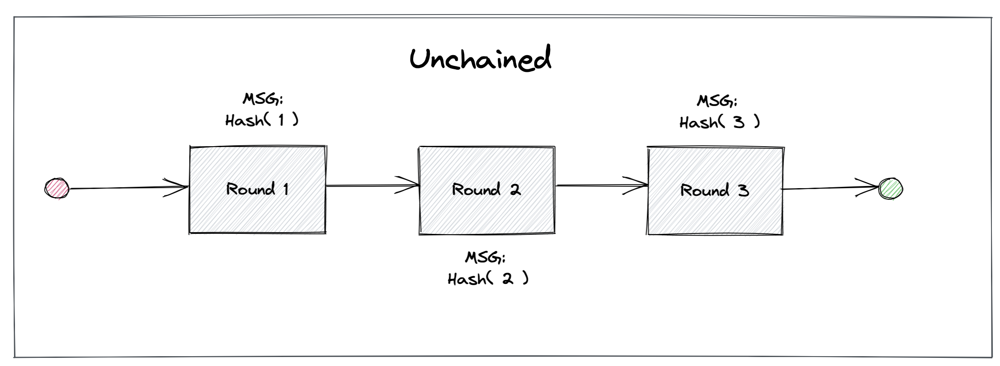

# Cryptography

This document provides an overview of the cryptographic building blocks that drand uses to generate
publicly-verifiable, unbiased, and unpredictable randomness in a distributed manner. The drand beacon has two phases (a setup phase, and a beacon phase), which we describe below.

Generally, we assume that there are $n$ participants, out of which at most $f<n$ are malicious. Drand heavily relies on [threshold cryptography](https://en.wikipedia.org/wiki/Threshold_cryptosystem) primitives, where (at least) a threshold of $t=f+1$ nodes have to work together to execute certain cryptographic operations successfully.

Threshold cryptography has many applications, as it avoids single points of failure. One such application is cryptocurrency multi-sig wallets, where $t$-of-$n$ participants are required to sign a transaction using a threshold signature scheme.

**Note**: This document is intended for a general audience, and no in-depth cryptographic background knowledge is necessary to understand the presented concepts.

## Setup phase

The purpose of the drand setup phase is to create a collective private, and public key pair shared among $n$ participants. This is done through a $t$-of-$n$ [Distributed Key Generation (DKG)](https://en.wikipedia.org/wiki/Distributed_key_generation) process at the end of which each of the $n$ participants obtains a copy of the **collective public key**, together with a **private key share** of the **collective private key**. The key shares are computed such that no individual node knows the entire collective private key.

Each private key share can then be used to perform cryptographic threshold computations, such as generating threshold signatures, where at least $t$ contributions produced using the individual private key shares are required to successfully finish the collective operation.

A DKG is performed in a fully distributed manner, avoiding any single points of failure. We give an overview of the different sub-components of the drand
[DKG implementation](https://github.com/dedis/kyber/tree/master/share/dkg/pedersen) in the following subsections.

### Secret sharing

[Secret sharing](https://en.wikipedia.org/wiki/Secret_sharing) is an important technique that many advanced threshold cryptography mechanisms rely on. Secret sharing allows one to split a secret value $s$ into $n$ shares $s_1,\ldots,s_n$ such that $s$ can only be reconstructed if a threshold of $t$ shares is available.

[Shamir's Secret Sharing](https://en.wikipedia.org/wiki/Shamir%27s_Secret_Sharing) (SSS) scheme is one of the most well-known and widely used secret sharing approaches, and it is a core component of drand. SSS works over an arbitrary finite field, but for simplicity, we use the integers modulo $p$ denoted by $\mathbb{Z}_p$. Let $s \in \mathbb{Z}_p$ denote the secret to be shared.

**Share Distribution**: To share $s$ a **dealer** first creates a polynomial $q(x) = a_0 + a_1x + ... + a_{t-1}x^{t-1}$ with $a_0 = s$ and (random) $a \in \mathbb{Z}p$ for $i = 1,\ldots,t-1$

The dealer then creates one share $s_i$ for each participant $i$ by evaluating $q(x)$ at the integer $i$ and setting $s_i = (i,q(i))$.

**Secret Reconstruction**: To recover the secret $s$, one first collects at least $t$ shares, then uniquely reconstructs $q(x)$ via [Lagrange interpolation](https://en.wikipedia.org/wiki/Lagrange_polynomial), and finally obtains $s$ as $s = a_0 = q(0)$.

Note that any subset of $t$-of-$n$ shares can be used to perform Lagrange interpolation and uniquely determine $s$. Having any subset of fewer than $t$ shares does not allow one to learn anything about $s$, though.

### Verifiable secret sharing

Shamir's Secret Sharing scheme assumes that the dealer is honest but this assumption might not always hold in practice.

A [Verifiable Secret Sharing](https://en.wikipedia.org/wiki/Verifiable_secret_sharing) (VSS)
scheme protects against malicious dealers by enabling participants to verify that their shares are consistent with those dealt to other nodes ensuring that the shared secret can be correctly reconstructed later on.

Drand uses [Feldman's VSS](https://ieeexplore.ieee.org/abstract/document/4568297) scheme, an extension of SSS. Let $\mathbb{G}$ denote a cyclic group of prime order $p$ in which computing discrete logarithms is intractable.

A cyclic group means there exists a generator $g$ such that any element $x \in \mathbb{G}$ can be written as $x = g^a$ for some $a \in {0,\ldots,p-1}$.

**Share Distribution**: In addition to distributing shares of the secret to the participants, the dealer also broadcasts commitments to the coefficients of the polynomial $q(x)$ of the form $(A_0,A_1,\ldots,A_{t−1}) = (g^s,g^{a_1},\ldots,g^{a_{t-1}})$.

These commitments enable each participant $i$ to verify that their share $s_i = (i,q(i))$ is consistent with respect to the polynomial $q(x)$ by checking that $g^{q(i)} = \prod_{j=0}^{t-1}(A_j)^{i^j}$ holds.

**Secret Reconstruction**: The recovery of secret $s$ works as in regular SSS with the difference that verified to be valid shares are used.

### Distributed key generation (DKG)

Although VSS schemes protect against a malicious dealer, the dealer still knows the secret itself. To create a collectively shared secret $s$ such that no individual node gets any information about it, participants can utilize a [Distributed Key Generation](https://en.wikipedia.org/wiki/Distributed_key_generation) (DKG) protocol.

Drand uses [Pedersen's DKG](https://www.cs.cornell.edu/courses/cs754/2001fa/129.PDF) scheme, which essentially runs $n$ instances of Feldman's VSS in parallel on top of some additional verification steps.

**Share Distribution**: Every participant $i$ creates a (random) secret $s_i \in \mathbb{Z}_p$ and shares it with all other participants using VSS by sending a share $s_{i,j}$ to each participant $j$ and broadcasting the list of commitments $(A{i,0},A_{i,1},\ldots,A_{i,t-1})$ to everyone.

**Share Verification**: Each participant verifies the shares it receives as prescribed by Feldman's VSS scheme. If participant $j$ receives an invalid share $s_{i,j}$ from participant $i$, then $j$ broadcasts a complaint. Afterward, participant $i$ must reveal the correct share $s_{i,j}$ or is considered an invalid dealer.

**Share Finalization**: At the end of the protocol, the final share of participant $i$ is $s_i = \sum_j s_{j,i}$ for all participants $j$ that are valid, i.e., for all those $j$ not excluded during the verification phase.

The collective public key associated with the valid shares can be computed as $S = \sum_j A_{j,0}$ for all valid participants $j$.

**Note**: Even though the secret created using Pedersen's DKG can be biased, it is safe to use for threshold signing as shown by [Rabin et al.](https://link.springer.com/content/pdf/10.1007%2F3-540-48910-X_21.pdf)

## Beacon phase

In the previous section, we gave an overview of how to produce a collective distributed key pair via a DKG protocol. In this section, we describe how to use this collective key pair to generate publicly-verifiable, unbiased, and unpredictable randomness in a distributed manner

We first give an overview of [pairing-based cryptography](https://en.wikipedia.org/wiki/Pairing-based_cryptography) (PBC) which has become quite popular lately and is used in many modern consensus protocols or zero-knowledge proofs such as [zk-SNARKs](https://z.cash/technology/zksnarks/).

Afterward, we show how drand uses PBC in the randomness beacon generation phase for [threshold Boneh-Lynn-Shacham (BLS) signatures](https://en.wikipedia.org/wiki/Boneh%E2%80%93Lynn%E2%80%93Shacham).

Finally, we explain how drand links the generated threshold BLS signatures into a randomness chain.

### Pairing-based cryptography

Pairing-based cryptography is based on _bilinear groups_ $(\mathbb{G}_1,\mathbb{G}_2,\mathbb{G_t})$ where $\mathbb{G}_1,\mathbb{G}_2,$ and $\mathbb{G_t}$ are cyclic groups of prime order $p$ with generators $g_1$, $g_2$, and $g_t$ respectively, and a pairing operation $e : \mathbb{G}_1  \times \mathbb{G}_2 \to \mathbb{G}_t$ with the following properties:

**Bilinearity**:
$\forall a,b \in \mathbb{Z}_p^{\ast}, \forall P \in \mathbb{G}_1, \forall Q \in \mathbb{G}_2$, we have $e(aP,bQ) = e(P,Q)^{ab}$.

**Non-degeneracy**: $e \neq 1$.

**Computability**: There exists an efficient algorithm to compute $e$.

Drand currently uses the [BLS12-381 curve](https://electriccoin.co/fr/blog/new-snark-curve/).

### Randomness generation

To generate publicly-verifiable, unbiased, distributed randomness, drand utilizes [threshold Boneh-Lynn-Shacham (BLS) signatures](https://en.wikipedia.org/wiki/Boneh%E2%80%93Lynn%E2%80%93Shacham).

Below we first describe regular [BLS signatures](https://www.iacr.org/archive/asiacrypt2001/22480516.pdf) followed by the threshold variant.

#### BLS signature

BLS signatures are short signatures that rely on bilinear pairings and consist only of a single element in $\mathbb{G}_1$.

They are _deterministic_ in the sense that a BLS signature depends only on the message and the signer's key unlike other signature schemes, such as
[ECDSA](https://en.wikipedia.org/wiki/Elliptic_Curve_Digital_Signature_Algorithm), which requires a fresh random value for each signed message to be secure.

Put differently, any two BLS signatures on a given message produced with the same key are identical. In drand, we utilize this property to achieve unbiasability for the randomness generation. The BLS signature scheme consists of the following sub-procedures:

**Key Generation**: To generate a key pair, a signer first chooses a private key $x \in \mathbb{Z}_p^{\ast}$ at random and then computes the corresponding public key as $X = g_2^x \in \mathbb{G}_2$.

**Signature Generation**: Let $H : \{0,1\}^{\ast} \to \mathbb{G}_1$ denote a cryptographic hash function that maps arbitrary bit strings to elements of $\mathbb{G}_1$.

To compute a BLS signature $\sigma$ on a message $m$, the signer simply computes $\sigma = xH(m) \in \mathbb{G}_1$.

**Signature Verification**: To verify that a BLS signature $\sigma$ on a message $m$ is valid, the verifier checks if $e(H(m),X) = e(\sigma,g_2)$ holds using the signer’s public key $X$.

It is easy to see that this equation holds for valid signatures since $e(H(m),X) = e(H(m),g_2^x) = e(H(m),g_2)^x = e(xH(m),g_2) = e(\sigma,g_2)$

#### Signature threshold

The goal of a threshold signature scheme is to collectively compute a signature by combining individual partial signatures independently generated by the participants. A threshold BLS signature scheme has the following sub-procedures:

**Key Generation**: The $n$ participants execute a $t$-of-$n$ DKG to setup a collective public key $S \in \mathbb{G}_2$, and private key shares $s_i \in \mathbb{Z}_p^{\ast}$ of the unknown collective private key $s$, as described above.

**Partial Signature Generation**: To sign a message $m$ each participant $i$ uses their private key share $s_i$ to create a _partial BLS signature_ $\sigma_i = s_{i}H(m)$.

**Partial Signature Verification**: To verify the correctness of a partial signature $\sigma_i$ on $m$, a verifier uses the public key share $S_i$, which is generated during the DKG, and verifies that $e(H(m),S_i) = e(\sigma_i,g_2)$ holds.

**Signature Reconstruction**: To reconstruct the collective BLS signature $\sigma$ on $m$, a verifier first needs to gather $t$ different and valid partial BLS signatures $\sigma_i$ on $m$ followed by a Lagrange interpolation on them.

**Signature Verification**: To verify a collective BLS signature $\sigma$, a verifier simply checks that $e(H(m),S_i) = e(\sigma_i,g_2)$ holds where $S$ is the collective public key.

Thanks to the properties of Lagrange interpolation, the value of $\sigma$ is independent of the subset of $t$ valid partial signatures $\sigma_i$ chosen during signature reconstruction.

Additionally, Lagrange interpolation also guarantees that no set of less than $t$ signers can predict or bias $\sigma$.

In summary, a threshold BLS signature $\sigma$ exhibits all properties required for publicly-verifiable, unbiased, unpredictable, and distributed randomness.

#### Smaller signatures for resource constrained applications

The above description of the signature threshold scheme accurately describes how we generate signatures that contain all the necessary properties for randomness under the `pedersen-bls-chained` and `pedersen-bls-unchained` schemes. 
Under these schemes, messages are mapped to a point on $\mathbb{G}_2$ and public keys are a point on $\mathbb{G}_1$. As a result, message signatures are 96 bytes long and public keys are 48 bytes long. For systems where users are signing large messages and/or storing a lot of public keys, this trade-off makes a lot of sense: a 96 byte signature will be a small proportion of the entire message stored or transmitted. Additionally, signatures can be aggregated to save space, whereas aggregation isn't usually desirable for public keys, thus minimizing the size of the public keys is optimal for most systems.
For drand however, we create a single public key at launch of the network and emit random beacons (and thus signatures) at a constant rate as long as the network is running. It is therefore more interesting to minimize the size of the signatures.
As of [v1.5.0](https://github.com/drand/drand/releases/tag/v1.5.0-testnet) drand supports a new scheme, `bls-unchained-on-g1`, which exploits the bilinearity property of the BLS signature scheme to swap the generator groups for signatures and public keys such that signatures are created on $\mathbb{G}_1$ and public keys are a point on $\mathbb{G}_2$. This reduces the storage requirements of the node operators by 50% as well as reducing latency and costs for any downstream users that require fetching and storing random beacons (such as smart contracts).

For many applications using BLS12-381, messages are large and the signature constitutes a small part of the payload size. For public-facing applications, such as in blockchain ecosystems, users of the system store their public key on a
Many applications built with BLS12-381 create many keypairs and subsequently publish or store many public keys.
Thus for that scheme, the following operations apply:

**Key Generation**: The $n$ participants execute a $t$-of-$n$ DKG to setup a collective public key $S \in \mathbb{G}_2$, and private key shares $s_i \in \mathbb{Z}_p^{\ast}$ of the unknown collective private key $s$.

**Partial Signature Generation**: To sign a message $m$ each participant $i$ uses their private key share $s_i$ to create a _partial BLS signature_ $\sigma_i = s_{i}H(m)$.

**Partial Signature Verification**: To verify the correctness of a partial signature $\sigma_i$ on $m$, a verifier uses the public key share $S_i$, which is generated during the DKG, and verifies that $e(H(m),S_i) = e(\sigma_i,g_1)$ holds.

**Signature Reconstruction**: To reconstruct the collective BLS signature $\sigma$ on $m$, a verifier first needs to gather $t$ different and valid partial BLS signatures $\sigma_i$ on $m$ followed by a Lagrange interpolation on them.

### Randomness
Drand nodes currently support three schemes, though they can roughly be divided into two modes: _chained_ or _unchained_. 

The drand randomness beacon operates in discrete rounds $r$. In every round, drand produces a new random value using threshold BLS signatures which can be linked together, or not, into a chain of randomness.

In **chained** mode, in order to extend the chain of randomness, each drand participant $i$ creates the partial BLS signature $\sigma_i^r$ on the message $m = H(r || \sigma_{r-1})$ in round $r$, where $\sigma_{r-1}$ denotes the (full) BLS threshold signature from round $r - 1$ and $H$ is a cryptographic hash function.

Chained mode is supported by using the `pedersen-bls-chained` scheme.

In **unchained** mode, in order to produce unchained randomness, each drand participant $i$ creates the partial BLS signature $\sigma_i^r$ on the message $m = H(r)$ in round $r$, where $H$ is a cryptographic hash function.

Unchained mode is supported by using the either the `pedersen-bls-unchained` or `bls-unchained-on-g1` scheme.

Once at least $t$ participants have broadcasted their partial signatures $\sigma_i^r$ on $m$, anyone can recover the full BLS threshold signature $\sigma_r$.

At that point, the random value of round $r$ is simply its hash $H(\sigma_r)$.

Afterward, drand nodes move to round $r+1$ and reiterate the above process.

For round $r=0$, drand participants sign a seed fixed during the drand setup. In **chained mode**, this process
ensures that every new random value depends on all previously generated signatures. Since the
signature is deterministic, there is also no possibility for an adversary of forking the chain and presenting two distinct signatures $\sigma_r$ and $\sigma_r^{'}$ in a given round $r$ to generate inconsistencies in the systems relying on public randomness.

In a nutshell, this construction of using the hash of a BLS signature can be considered as a [Verifiable Random Function](https://people.csail.mit.edu/silvio/Selected%20Scientific%20Papers/Pseudo%20Randomness/Verifiable_Random_Functions.pdf) because of the uniqueness of the signature output combined with the usage of the random oracle (the hash function). When the input is unpredictable, the output of the random oracle is indistinguishable from a uniform distribution.

## Conclusion

To summarize, drand is an efficient randomness beacon daemon that utilizes pairing-based cryptography, $t$-of-$n$ distributed key generation, and threshold BLS signatures to generate publicly-verifiable, unbiased, unpredictable, distributed randomness.

To learn more about the background of drand, we refer to the [corresponding slides](https://docs.google.com/presentation/d/1t2ysit78w0lsySwVbQOyWcSDnYxdOBPzY7K2P9UE1Ac/edit?usp=sharing).

Finally, for more formal background on public randomness, we refer to the research paper titled ["Scalable Bias-Resistant Distributed Randomness"](https://eprint.iacr.org/2016/1067.pdf) published at the [38th IEEE Symposium on Security and Privacy](https://www.ieee-security.org/TC/SP2017/).

The threshold scheme described here is described and proven in [this paper from Boldyreva](https://www.iacr.org/archive/pkc2003/25670031/25670031.pdf).
