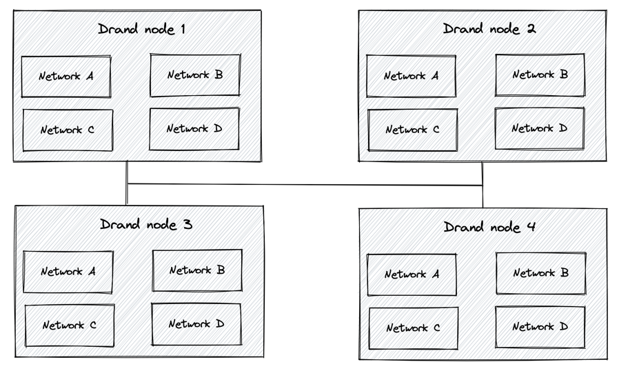
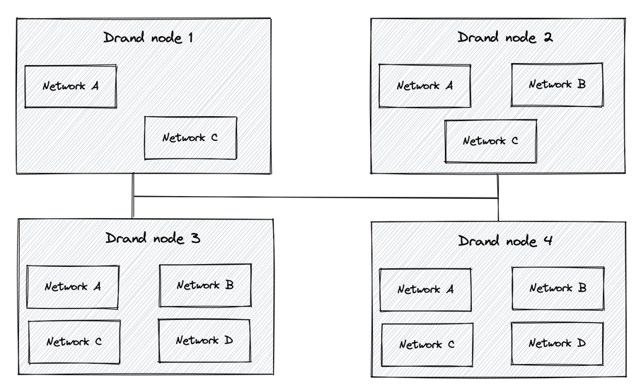
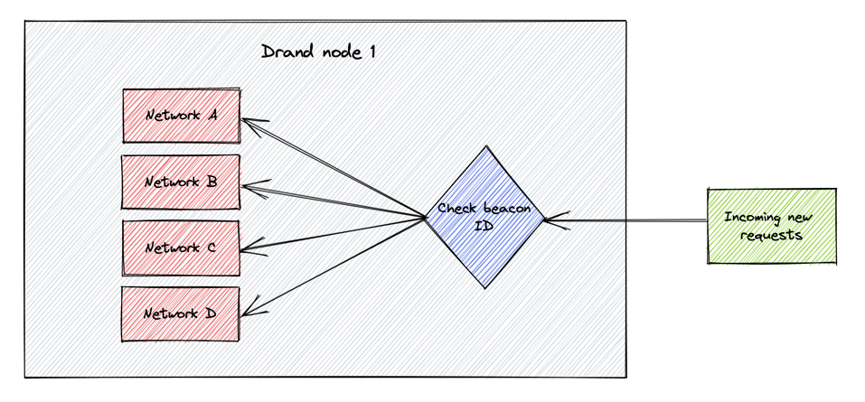
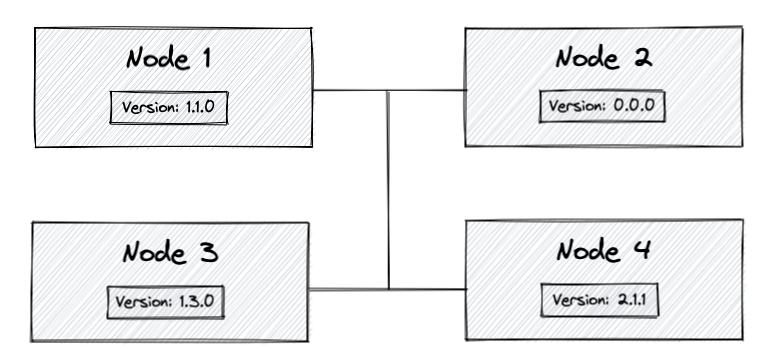

# Specification

Drand (pronounced "dee-rand") is a distributed randomness beacon daemon written
in Golang. Servers running drand can be linked with each other to produce
collective, publicly verifiable, unbiased, unpredictable random values at fixed
intervals using bilinear pairings and threshold cryptography. Drand nodes can
also serve locally-generated private randomness to clients.

This document is a specification of the drand protocols.

## Notations

### Drand node

A drand node is a server that runs the drand code, participates in the
distributed key generation (DKG) process and the randomness generation and that can
reply to public request API. It can instantiate and run multiple independent 
internal randomness processes, where each of them has its own randomness generation frequency.
The following representation is what gets embedded in each group configuration 
file, one per randomness process. This is what each process knows about other 
drand nodes on its own network:

```go
type Node struct {
    Key []byte  // public key on bls12-381 G1
	Addr string // publicly reachable address of the node
	TLS bool // reachable via TLS
	Signature []byte 
	Index uint32 // index of the node w.r.t. to the network
}
```

A node can be referenced by its hash as follows:

```go
func (n *Node) Hash() []byte {
	h := hashFunc()
	_ = binary.Write(h, binary.LittleEndian, n.Index)
	_, _ = n.Identity.Key.MarshalTo(h)
	return h.Sum(nil)
}
```

**Public Key**: Public keys of drand nodes are points on the G1 group of the
BLS12-381 curve. See the [curve](#drand-curve) section for more information.

### Drand network
Each group of nodes that runs a specific process (e.g., one with the same set of parameters) constitutes a separate network. 
Each network will act as an independent beacon generator. 

### Drand beacon

A drand beacon is what the drand network periodically creates and that can be
used to derive the randomness. A beacon contains the signature of the previous
beacon generated, the round of this beacon and signature. See the [beacon
chain](#beacon-chain) section for more information.

### Beacon ID
The `Beacon ID` is the unique identifier among existing beacon processes running on a drand node. Thanks to
this ID, each drand node can dispatch messages received to the correct internal 
process to attend it. The `Beacon ID` is set by the leader when starting a new beacon and stays the same for the lifetime of the process. For backward 
compatibility reasons, the default id for pre-existing beacon is an empty string. The
word `default` is reserved as an equivalent.

### Metadata
Each request sent by a drand node will contain this field. It is used to hold any important message-related data
nodes need to communicate to others. The protobuf definition for this field is:

```go
message Metadata {
  NodeVersion node_version = 1;
  string beaconID = 2;
  bytes chain_hash = 3;
}
```

### Scheme
A scheme is a network-level configuration that a coordinator can set when starting a new network. There 
is fixed quantity of possible values. Each one establishes a different set of parameters which affects 
some working aspects of the network. If no scheme is set on network starting, a default value is used.
The available scheme are:

```go
// DefaultSchemeID is the default scheme ID.
const DefaultSchemeID = "pedersen-bls-chained"

// UnchainedSchemeID is the scheme id used to set unchained randomness on beacons.
const UnchainedSchemeID = "pedersen-bls-unchained"
```

As you can notice, the default value is `pedersen-bls-chained`. This is because of backward-compatibility
reasons. Drand nodes older or equal to version `1.3.0`, which don't know anything about schemes, 
use this set of parameters.

### Group configuration

Group configuration: A structure that contains all the necessary information
about a running drand network:

- Nodes: A list of nodes information that represents all nodes on the network.
- Threshold: The number of nodes that are necessary to participate to a
  randomness generation round to produce a new random value. Given the security
  model of drand, the threshold must be superior to 50% of the number of nodes.
- Period: The period at which the network creates new random value. Also referred to as "frequency".
- ID: The ID which a drand node uses to tag each message in order to run more than one 
  beacon processes (i.e., participate in more than one networks) at the same time.
- Scheme: The id of the scheme a network uses to define a group of configuration
  values related to the randomness generation process.
- GenesisTime: An UNIX timestamp in seconds that represents the time at which
  the first round of the drand chain starts. See the [beacon
  chain](#beacon-chain) section for more information.
- GenesisSeed: A generic slice of bytes that is the input for nodes that create
  the first beacon. This seed is the hash of the initial group configuration, as
  shown below.
- Distributed public key: A list of points used to verify the partial and final
  beacons created by the network. This field is nil if the network hasn't ran
  the setup phase yet. Each point lies on the group G1 of the BLS12-381 curve.
- TransitionTime: An UNIX timestamp in seconds that represents the time the
  network denoted by this group configuration took over a previous network. This
  field is empty is the network has never reshared yet. See TODO for more
  information.

**Note**: This group information is only shared between internal processes of 
drand nodes. Even though it doesn't expose private key materials it non-essential 
information from the point of view of users. A public struct derived from 
the group to share to clients is described in the [root of trust section](#root-of-trust).

#### Group configuration hash

The group configuration can be uniquely referenced via its canonical hash. The
hash of the group file is used during a resharing procedure to make sure node
are resharing from the correct group.
The hash is derived using the blake2b hash function. The Go procedure works as
follow:

```go
func (g *Group) Hash() []byte {
	h := hashFunc()

	sort.Slice(g.Nodes, func(i, j int) bool {
		return g.Nodes[i].Index < g.Nodes[j].Index
	})

	// all nodes public keys and positions
	for _, n := range g.Nodes {
		_, _ = h.Write(n.Hash())
	}

	_ = binary.Write(h, binary.LittleEndian, uint32(g.Threshold))
	_ = binary.Write(h, binary.LittleEndian, uint64(g.GenesisTime))

	if g.TransitionTime != 0 {
		_ = binary.Write(h, binary.LittleEndian, g.TransitionTime)
	}

	if g.PublicKey != nil {
		_, _ = h.Write(g.PublicKey.Hash())
	}

	// Use it only if ID is not empty. Keep backward compatibility
	if g.ID != "" {
		_, _ = h.Write([]byte(g.ID))
	}

	return h.Sum(nil)
}
```

## Wireformat & API

Drand currently uses [gRPC](https://grpc.io/) as the networking protocol. All
exposed services and protobuf definitions are in the
[protocol.proto](https://github.com/drand/drand/blob/master/protobuf/drand/protocol.proto)
file for the intra-nodes protocols and in the
[api.proto](https://github.com/drand/drand/blob/master/protobuf/drand/api.proto)
file.

## Drand node

Generating public randomness is the primary functionality of drand. Public
randomness is generated collectively by drand nodes and is made publicly available.
Each node can run multiple processes (i.e., participate in multiple networks) at the same time, each of which is independent of each other,
with its own set of parameters. All processes use the same node address to send messages to
and the node will identify and dispatch the request to the correct process/network (running
internally) using an ID, known as the `Beacon ID`.

The following diagram explains visually the above operation.



In the above figure, each drand node is running 4 processes, i.e., participates in 4 different randomness generation networks. Each one of a node's processes communicates with
the corresponding process running in the rest of the nodes, i.e., the process "Network A" in Node 1 communicates with the process "Network A" in nodes 2, 3 and 4, in order to achieve their common goal: generate public randomness.
It is worth highlighting that not all nodes need to participate in all networks, i.e., run all existing processes. The following
diagram shows this scenario.



Messages are delivered to the correct internal process by a module that checks the `Beacon ID` inside the request and redirecting the message accordingly.




## Drand versioning
Each request sent by a drand node will contain the actual drand protocol version that the node is using. Drand uses [semantic
versionin](https://semver.org) as versioning protocol. This has a clear purpose. Only nodes with same 
MAJOR version will be allowed to communicate with each other. For backward-compatibility reasons, 
the fallback value will be `0.0.0`, and nodes with this version will always be allowed to communicate
with other nodes. The protobuf definition for this field is:

```go
message NodeVersion {
    uint32 major = 1;
    uint32 minor = 2;
    uint32 patch = 3;
}
```

**Notes**: The `NodeVersion` is present inside the `Metadata` field.

In the following diagram, we can see:

- Node 2 will be able to interact the rest of the nodes. 
- Node 4 will be only able to interact with nodes whose version is 2.X.X. In this case, it cannot communicate with any other node.
- Nodes 1 and 3 will be only able to interact with nodes whose version is 1.X.X. In this case, they can communicate with each other.




**Notes**: Node 2 is a node where node-versioning feature is not supported. This node has not been updated to the latest version (above 1.3). In this case, 
`Metadata` won't be present on requests, so the fallback version other nodes infer is `0.0.0`.

## Drand modules

The A drand network is composed of a distributed set of nodes and has two
phases / modules:

- Setup: The nodes perform a distributed key generation (DKG) protocol to create
  the collective public key and one private key share per node. The participants
  never see/use the actual (distributed) private key explicitly but instead
  utilize their respectiveprivate key shares for the generation of public
  randomness.
- Generation: After the setup, the nodes switch to the randomness generation
  mode. Each node periodically broadcasts a partial signature to all the other
  participants sign using a t-of-n threshold version of the Boneh-Lynn-Shacham
  (BLS) signature scheme with their respective private key shares. Once any node
  (or third-party observer) has gathered t partial signatures, it can
  reconstruct the full BLS signature, that can be verified against the
  distributed public key. The signature is then simply the hash of that
  signature, to ensure that there is no bias in the byte representation of the
  final output.

### Setup phase

To setup a new network, drand uses the notion the of a _coordinator_ that
collects the public key of the participants, creates the group configuration
once all keys are received, push it back to participants and then start the
distributed key generation phase. The coordinator is a member of the new group
by default. At this stage, the coordinator is trusted for setting up the group
configuration and for starting the Distributed Key Generation.

This setup phase uses the notion of a common _secret_ between all participants.
That way, only the participants that know the same secret are able to be listed
in the new group configuration.

#### Getting the public key of the coordinator

Participants needs to know at least the address _and_ public key of the coordinator. Drand provides a simple gRPC call that returns the public key of the node.
**Note**: This part is not _required_ by the spec but is implemented by drand
for simplicity of use. This protocol relies the TOFU ("Trust On First Use")
approach: the coordinator is trusted for this and the subsequent phase and gives
us a valid public key. A node/implementation can skip this step if it knows
already the public key of the coordinator by another mean (out of band, gossip,
etc)
The gRPC endpoint call is:

```protobuf
rpc GetIdentity(IdentityRequest) returns (Identity);

message IdentityRequest {
    common.Metadata metadata = 1;
}
message Identity {
    string address = 1;
    bytes key = 2;
    bool tls = 3;
    // BLS signature over the identity to prove possession of the private key
    bytes signature = 4;
}
```

#### Collecting the keys of the participants

Each non-coordinator participant sends their information via the following RPC
call:

```protobuf
rpc SignalDKGParticipant(SignalDKGPacket) returns (drand.Empty);
```

The relevant protobuf packets are the following:

```protobuf
// SignalDKGPacket is the packet nodes send to a coordinator that collects all
// keys and setups the group and sends them back to the nodes such that they can
// start the DKG automatically.
message SignalDKGPacket {
    Identity node = 1;
    bytes secret_proof = 2;
    // In resharing cases, previous_group_hash is the hash of the previous group.
    // It is to make sure the nodes build on top of the correct previous group.
    bytes previous_group_hash = 3;
    //
    common.Metadata metadata = 4;
}
```

#### Coordinator pushing the new group configuration

Once the coordinator has received the expected number of node informations, then
he creates the group configuration (the operator has given the parameters such as
threshold and period to the drand logic).
When creating a group from only public keys and addresses of the node, the
_index_ of a node is determined by the lexigraphical order of the public keys as
slice of bytes.
The coordinator then pushes the group configuration to the participants via the
following RPC call:

```protobuf
rpc PushDKGInfo(DKGInfoPacket) returns (drand.Empty);
```

with the relevant protobuf packets as follow:

```protobuf
// PushDKGInfo is the packet the coordinator sends that contains the group over
// which to run the DKG on, the secret proof (to prove it's he's part of the
// expected group, and it's not a random packet) and as well the time at which
// every node should start the DKG.
message DKGInfoPacket {
    drand.GroupPacket new_group = 1;
    bytes secret_proof = 2;
    // timeout in seconds
    uint32 dkg_timeout = 3;
    // signature from the coordinator to prove he is the one sending that group
    // file.
    bytes signature = 4;
    //
    common.Metadata metadata = 5;
}
// GroupPacket represents a group that is running a drand network (or is in the
// process of creating one or performing a resharing).
message GroupPacket {
    repeated Node nodes = 1; 
    uint32 threshold = 2;
    // period in seconds
    uint32 period = 3;
    uint64 genesis_time = 4;
    uint64 transition_time = 5;
    bytes genesis_seed = 6;
    repeated bytes dist_key = 7;
    // catchup_period in seconds
    uint32 catchup_period = 8;
    string schemeID = 9;
    common.Metadata metadata = 10;
}
```

As soon as a participant receives this information from the coordinator, then he
must be ready to accept DKG packets, but he does not start immediately sending
his packet. After the coordinator has successfully sent the group to all
participants, he starts sending the first packet of the distributed key
generation. All nodes that receive the first packet of the DKG from the
coordinator (or else, due to network shifts) must send their first packet of the
DKG as well and start the ticker as explained below.

### Distributed key generation

The distributed key generation protocol implements the Joint Feldman protocol,
best described from [Gennaro's
paper](https://www.researchgate.net/publication/225722958_Secure_Distributed_Key_Generation_for_Discrete-Log_Based_Cryptosystems):

> Distributed key generation (DKG) is a main component of threshold
> cryptosystems. It allows a set of n servers to generate jointly a pair of
> public and private keys without assuming any trusted party. A DKG may be run
> in the presence of a malicious adversary who corrupts a fraction (or
> threshold) of the parties and forces them to follow an arbitrary protocol of
> their choice.

Note that the nodes that finish the protocol successfully, called "qualified
nodes" may be a subset of the nodes that started it: there can be nodes offline
and nodes malicious during the protocol that will get excluded unless they act
accordingly to the protocol.

#### Types of distributed key generation

Drand supports two operations with respect to setting up a distributed key:

- Fresh setup: nodes have no prior shares and want to run the protocol from scratch
- Resharing: Resharing enables to _remove_ and _add_ new nodes to a group, while
  keeping the same public facing information, namely the distributed key. There
  is already a first group of nodes A that have ran the DKG protocol and have
  shares of a distributed private key. This group wants to "re-share their
  shares" to a second group of nodes B. Nodes of group B has no prior shares and
  only the knowledge of the longterm public keys of nodes in group A. After the
  resharing, nodes in group B will be able to use their new shares to produce
  randomness and nodes in group A will not be able to participate in randomness
  generation with the nodes in group B. the Note that a node can be in group A
  and B as well.

The rest of this section highlights the network level operations that are valid
for both types of DKG. Even though the main logic is similar for the two types,
the cryptography section explains in details the difference between the two.

#### Network level packets

For a new setup, nodes exchanges the DKG packets
using the following RPC call:

```protobuf
rpc BroadcastDKG(DKGPacket) returns (drand.Empty);
```

and the following protobuf packets:

```protobuf
// DKGPacket is the packet that nodes send to others nodes as part of the
// broadcasting protocol.
message DKGPacket{
    dkg.Packet dkg = 1;
    common.Metadata metadata = 2;
}
// dkg.proto
// Packet is a wrapper around the three different types of DKG messages
message Packet {
    oneof Bundle {
        DealBundle deal = 1;
        ResponseBundle response = 2;
        JustificationBundle justification = 3;
    }
    common.Metadata metadata = 4;
}
```

All messages of the DKG have a canonical hash representation and each node signs
that hash before sending out the packet, therefore providing authentication of
the messages. The signature scheme is the regular BLS signature as explained in
the [cryptography](#cryptographic-specification) section.

#### Phase transitions

The protocol runs in _at most_ 3 phases: `DealPhase`, `ResponsePhase` and
`JustificationPhase`. The `FinishPhase` is an additional local phase where nodes
compute their local private share. However, it can finish after the first two
phases if there is malicious interference or offline nodes during the first
phase.

The way the protocol transition works is via time-outs. As soon as a node starts
the DKG protocol, it starts a ticker that triggers each transition phase.
Example:

- DKG timeout is set to 30s
- Node 1 starts the DKG at time T, so he is in `DealPhase` and sends its deals
  to every other node.
- Node 1's ticker ticks at time T+30s, and node 1 enters the `ResponsePhase` and
  sends its responses to every other node. Each `Response` can be a complaint or a
  success depending on the deal the node received at the previous step.
- Node 1's ticker ticks at time T+60s, and node 1 enters the
  `JustificationPhase` _if there was no complaint response received_ OR in
  `FinishPhase` otherwise.

**Fast Sync**: drand uses a _fast sync_ mode that allows to make the setup
phase proceeds faster at the cost of higher bandwidth usage. Given the
relatively low size of the network, the latter is not a concern. The general
idea is to move to the next step before the ticker kicks in if we received the
messages of the phase from all other nodes already. In more details:

- nodes go into the `ResponsePhase` as soon as they received deals from
  everybody else OR when the ticker kicks in.
- nodes go into the `FinishPhase` as soon as they received "success" responses
  from all other nodes (i.e. all deals were correct) OR
- nodes go into the `JustificationPhase` as soon as they received all responses
  from all other nodes, where at least one of the responses is a complaint.
- The transition from the `JustificationPhase` to the `FinishPhase` is done
  locally: when a node received all justifications or when the ticker kicks in,
  the nodes compute their final share. The beacon chain is starting at a
  pre-defined time so it doesn't impact how nodes are handling this last phase.

The phases and the respective messages are described in more details in the
following sections.

#### Deal phase

In this first phase, nodes sends their "deal" containing their encrypted share
to the other nodes as well as the public polynomial from which those shares are
derived. The share is encrypted via ECIES using the public key of the recipient
share holder. A node bundles all its deals into a `DealBundle` that is
signed.Here is the protobuf wire specification of the deals:

```protobuf
// DealBundle is a packet issued by a dealer that contains each individual
// deals, as well as the coefficients of the public polynomial he used.
message DealBundle {
    // Index of the dealer that issues these deals
    uint32 dealer_index = 1;
    // Coefficients of the public polynomial that is created from the 
    // private polynomial from which the shares are derived.
    repeated bytes commits = 2;
    // list of deals for each individual share holders.
    repeated Deal deals = 3;
    // session identifier of the protocol run
    bytes session_id = 4;
    // signature over the hash of the deal
    bytes signature = 5;
}

// Deal contains a share for a participant.
message Deal {
    uint32 share_index = 1;
    // encryption of the share using ECIES
    bytes encrypted_share = 2;
}
```

Each `DealBundle` is authentificated so a node can know when they received all
expected `DealBundle`, one from each node, by looking at the
`dealer_index` field of all `DealBundle`. If that is the case, the node can
directly transition to the `ResponsePhase`. Otherwise, the node needs to wait
until the ticker kicks in for the next timeouts, before entering the
`ResponsePhase`.

#### Response phase

In this second phase, each node first process all their deals received during
the previous phase. Each nodes then sends a Response for each shares they have
received and _should_ have received: if there is a missing share for a node,
this node will send a response for it as well. A `Response` contains both the
"share holder" index and the "dealer index" as well as a status. If the share
holder found its share from that dealer invalid, the status is set as a
complaint (`false`) and if the share was valid, the status is set as a success
(`true`).
A node bundles all its responses into a `ResponseBundle` that is signed. Here is
the protobuf description:

```protobuf
// ResponseBundle is a packet issued by a share holder that contains all the 
// responses (complaint and/or success) to broadcast.
message ResponseBundle {
    uint32 share_index = 1;
    repeated Response responses = 2;
    // session identifier of the protocol run
    bytes session_id = 3;
    // signature over the hash of the response
    bytes signature = 4;
}

// Response holds the response that a participant broadcast after having
// received a deal.
message Response {
    // index of the dealer for which this response is for
    uint32 dealer_index = 1;
    // Status represents a complaint if set to false, a success if set to 
    // true.
    bool status = 2;
}
```

When a node received all expected `ResponseBundle` from each node OR when the
ticker kicks in, the node decides to which phase to proceed to:

- If all `Response.status` from each `ResponseBundle` are set to true, the node
  can directly go into the `FinishPhase` and compute their final share.
- If not, then the node needs to go into the `JustificationPhase`.

#### Justification phase

For each "complaint" responses (i.e. `status == false`) whose`dealer_index` is
equal to their index, a node sends a `Justification` packet that contains the
non-encrypted share that the share holder should have received. The goal here is
that every node will be able to verify the validity of the share now that is
unencrypted.
A node bundles all its `Justifications` into a `JustificationBundle` that is
signed. Here is the protobuf description:

```protobuf
// JustificationBundle is a packet that holds all justifications a dealer must
// produce
message JustificationBundle {
    uint32 dealer_index = 1;
    repeated Justification justifications = 2;
    // session identifier of the protocol run
    bytes session_id = 3;
    // signature over the hash of the justification
    bytes signature = 4;
}

// Justification holds the justification from a dealer after a participant
// issued a complaint response because of a supposedly invalid deal.
message Justification {
    // represents for who share holder this justification is
    uint32 share_index = 1;
    // plaintext share so everyone can see it correct
    bytes share = 2;
}
```

A node can silently waits until it receives all justification expected or the
ticker kicks in to go into the `FinishPhase`.

#### Finish phase

In the `FinishPhase`, each node locally look at the shares they received and
compute both their final share and the distributed public key. For the DKG to be
sucessful, there must be at least more than a threshold of valid shares. For
more detail, see the [cryptography](#cryptographic-specification) section. Each node must save
the group configuration file augmented with the distributed key. This
configuration file is now representative of functional current drand network.

When a node stored the new group file, it switches to the randomness generation
protocol. Given there might be slight time delays, it must already be ready to
accept packets for this. However, the node must only start generating randomness
at the time specified in the `GenesisTime` of the group configuration file.

### Randomness generation

The randomness generation protocol works in its simple form by having each node
periodically broadcasts a "partial" signature over a common input. Each nodes
waits to receive these partial signatures, and as soon as one has a subset of at
least a "threshold" (parameter given in the group configuration file) of those,
this node can reconstruct the final signature. The final signature is a regular
BLS signature that can be verified against the distributed public key. If that
signature is correct, then the randomness is simply the hash of it:

```go
rand := sha256.Sum256(signature)
```

Note here that the hash function shown here is simply an example, a suggestion.
An application is free to hash the signature using any secure hash function. The
important point is to verify to validity of the signature.

#### Randomness generation period

The drand network outputs a new random beacon every period and associates a
beacon "round" to a specific time. The mapping between a time and a round allows
to exactly determine the round number for any given time in the past or future.
The relation to determine this mapping is as follow:

```go
// Parameters:
// * now: UNIX timestamp in seconds
// * genesis: UNIX timestamp in seconds
// * period: period in seconds
// Returns:
// * round: the round number at which the drand network is at
// * the time at which this round started
func CurrentRound(now, genesis int64, period uint32) (round uint64, time int64){
	if now < genesis {
		// round 0 is the genesis block: signature is the genesis seed
		return 0
	}
	fromGenesis := now - genesis
	// we take the time from genesis divided by the periods in seconds, that
	// gives us the number of periods since genesis.  We add +1 because round 1
	// starts at genesis time.
	round = uint64(math.Floor(float64(fromGenesis)/period)) + 1
	time = genesis + int64(nextRound*uint64(period.Seconds()))
	return
}
```

Each node starts sending their partial signature for a given round when it is
time to do so, according to the above function. Given the threat model, there
is always enough honest nodes such that the chain advances at the correct speed.
In case this is not true at some point in time, please refer to the [catchup
section](#catchup-mode) for more information.

#### Beacon: chained or unchained

Drand has now the ability to work in two different modes regarding randomness generation: chained or unchained.
In the first case, drand binds the different random beacon together so they form a chain of random
beacons. Remember a drand beacon is structured as follows:

```go
type Beacon struct {
	Round uint64
	PreviousSignature []byte
	Signature []byte
}
```

- The `Round` is the round at which the beacon was created, as explained in the
  previous section.
- The `PreviousSignature` is the signature of the beacon that was created at
  round `Round - 1`
- `Signature` is the final BLS signature created by aggregating at least
  `Threshold` of partial signatures from nodes.

This structure makes it so that each beacon created is building on the previous
one therefore forming a randomness chain.

In the second case, drand keeps binding the different random beacon together, but this is not strictly necessary. The 
chain integrity won't be required in other to verify a random value generated.

**Notes**: Drand can choose between these two working modes using the `--scheme` flag. 
See [scheme](#scheme) section for more information.

**Partial beacon creation**: At each new round, a node creates a `PartialBeacon`
with the current round number, the previous signature and the partial signature
over the messagem with [RoundToBytes](https://github.com/drand/drand/blob/v1.2.1/chain/store.go#L39-L44)
being an 8 bytes fixed length big-endian serializer. 

To determine the "current round" and the "previous signature", the node loads it
last generated beacon and sets the following:

```go
currentRound = lastBeacon.Round + 1
previousSignature = lastBeacon.Signature
```

It is important to note that the current round may not be necessarily the round
of the current time. More information in the following section.

**Partial beacon broadcast**: Each node then calls the following RPC call:

```protobuf
rpc PartialBeacon(PartialBeaconPacket) returns (drand.Empty);
```

with the following protobuf packets:

```protobuf
message PartialBeaconPacket {
    // Round is the round for which the beacon will be created from the partial
    // signatures
    uint64 round = 1;
    // signature of the previous round - could be removed at some point but now
    // is used to verify the signature even before accessing the store
    bytes previous_sig = 2;
    // partial signature - a threshold of them needs to be aggregated to produce
    // the final beacon at the given round.
    bytes partial_sig = 3;
    //
    common.Metadata metadata = 4;
}
```

**Final beacon creation**: For each incoming partial beacon packet, a
node must first verify it, using the partial signature verification routine and
then stores it in a temporary cache if it is valid. As soon as there is at
least a threshold of valid partial signatures, the node can aggregate them to
create the final signature.

```go
func (v Verifier) DigestMessage(currRound uint64, prevSig []byte) []byte {
	h := sha256.New()

	if !v.scheme.DecouplePrevSig {
		_, _ = h.Write(prevSig)
	}
	_, _ = h.Write(RoundToBytes(currRound))
	return h.Sum(nil)
}
```
As you can notice here, the previous signature is taken into account
only if the scheme configuration indicates it.

**Validation of beacon and storage**: Once the new beacon is created, the node
verifies its signature, loads the last saved beacon from the database and tries to 
put it on database, applying a series of checks before it:

```go
func (a *appendStore) Put(b *chain.Beacon) error {
	a.Lock()
	defer a.Unlock()
	if b.Round != a.last.Round+1 {
		return fmt.Errorf("invalid round inserted: last %d, new %d", a.last.Round, b.Round)
	}
	if err := a.Store.Put(b); err != nil {
		return err
	}
	a.last = b
	return nil
}


func (a *schemeStore) Put(b *chain.Beacon) error {
	a.Lock()
	defer a.Unlock()

	// If the scheme is unchained, previous signature is set to nil. In that case,
	// relationship between signature in the previous beacon and previous signature
	// on the actual beacon is not necessary. Otherwise, it will be checked.
	if a.sch.DecouplePrevSig {
		b.PreviousSig = nil
	} else if !bytes.Equal(a.last.Signature, b.PreviousSig) {
		return fmt.Errorf("invalid previous signature")
	}

	if err := a.Store.Put(b); err != nil {
		return err
	}

	a.last = b
	return nil
}
```

There should never be any gaps in the rounds. A node can now expose it to the external API.

#### Root of trust

In drand, we can uniquely identify a chain of randomness via a tuple of
information:

```go
// Info represents the public information that is necessary for a client to
// very any beacon present in a randomness chain.
type Info struct {
	PublicKey   kyber.Point   `json:"public_key"`
	ID          string        `json:"id"`
	Period      time.Duration `json:"period"`
	Scheme      scheme.Scheme `json:"scheme"`
	GenesisTime int64         `json:"genesis_time"`
	GroupHash   []byte        `json:"group_hash"`
}
```

This information is constant regardless of the network composition: even after a
resharing is performed, the chain information is constant.

This root of trust is to be given to clients to embed in the application. For
simplicity, we also refer to the chain information by its hash of the `Info`
structure:

```go
// Hash returns the canonical hash representing the chain information. A hash is
// consistent throughout the entirety of a chain, regardless of the network
// composition, the actual nodes, generating the randomness.
func (c *Info) Hash() []byte {
	h := sha256.New()
	_ = binary.Write(h, binary.BigEndian, uint32(c.Period.Seconds()))
	_ = binary.Write(h, binary.BigEndian, c.GenesisTime)

	buff, err := c.PublicKey.MarshalBinary()
	if err != nil {
		log.DefaultLogger().Warnw("", "info", "failed to hash pubkey", "err", err)
	}

	_, _ = h.Write(buff)
	_, _ = h.Write(c.GroupHash)

	// Use it only if ID is not empty. Keep backward compatibility
	if c.ID != "" {
		_, _ = h.Write([]byte(c.ID))
	}

	return h.Sum(nil)
}
```

#### Catchup mode

Nodes must have a ticker that kicks in every period of time (started at the
genesis time). At each kicks, a node loads its last beacon generated and runs
the protocol as shown above. Under normal circumstances, the `Round` field
should be the round that corresponds to the current time.

**Network halting**: However, it may happen that there is not enough partial
beacon being broadcasted at one time therefore there will not be any random
beacon created for this round. Under these circumstances, nodes can enter a
"catchup" mode.

To detect if the network is stalled, each node at each new tick must verify that
the `lastBeacon.Round + 1` equals the current round given by their local clock.
If that is not the case, that means there wasn't a random beacon generated in
time in the previous round OR this node didn't receive enough partial beacons for
some reasons.

If that condition is true, nodes must first try to sync with each other: each node
asks the other nodes if they have a random beacon at the round `lastBeacon.Round + 1`
AND higher beacons as well. If a node receives a valid beacon for the
requested round, that means the network is still producing randomness but for
some networking reasons, he didn't receive correctly the partial beacons. In
this case, if the last beacon received corresponds to the current round, the
node must wait on the next tick and continue as usual.

If the sync didn't return any more recent valid beacons, that probably means the
network is stalled. In that case, nodes must continue to broadcast the same
partial beacon as usual at every tick.

**Network catchup**: At some point, there will be enough honest & alive nodes to
broadcast their partial signatures such that a new beacon can be aggregated, for
the round R. However, that round R does not correspond to the current round
given their local clock. In this situation, each node must produce their partial
beacons until the current round as fast as possible. More concretely, each node
broadcasts their new partial beacon from the last generated beacon until they
reach the current round according to the local clock. As soon as a new beacon is
aggregated, nodes look if the round corresponds to the current round, and if
not, prepare to broadcast their next partial signatures.

**Example**:

- Period is 30s, genesis time = 10
- Beacon for round 1 generated at T = 10
- Beacon for round 2 generated at T = 40
- Outage of multiple honest nodes for 70s
- When the honest nodes are back online, it's time T = 40+70 = 110 + Beacons round 3 (T=70), round 4 (T=100) should have been generated in the meantime
- When the nodes come back online, they try to sync with each other
  - They all see all nodes only have the beacon round 2 as the "head" of the
    chain
  - Therefore, they go into "catchup mode"
- Nodes send a partial beacon for round 3 at time T = 100 (+ some delta for
  syncing)
- As soon as a node has enough partial beacon for round 3, he creates the final
  beacon for round 4
  - It then moves to the next round automatically, since round 4 is still in the past
- All nodes continue on this mode until all have the round 4 as their heads and
  as long the the current time is less than T=130, since that corresponds to
  round 5
- All nodes wait for the round 5 as usual.

#### Syncing

When a drand node is offline, restarted or detects a halt in the chain's
progress (previous section), a node should sync to all other nodes in the
network. A node indicates the last beacon saved in its database and calls the
following RPC:

```protobuf
rpc SyncChain(SyncRequest) returns (stream BeaconPacket);
```

with the following protobuf packet:

```protobuf
// SyncRequest is from a node that needs to sync up with the current head of the
// chain
message SyncRequest {
    uint64 from_round = 1;
    common.Metadata metadata = 2;
}

message BeaconPacket {
    bytes previous_sig = 1;
    uint64 round = 2;
    bytes signature = 3;
    common.Metadata metadata = 4;
}
```

**Client side**: For each incoming `BeaconPacket`, the node runs the regular
beacon verification routine as usual. The client stops the syncing process
(closes the RPC call) when the last valid beacon's round returned is equal to
the current round.

**Server side**: For sync request, the node must load the beacon which has the
given round requested and sends back all subsequent beacons until the last one.

## Cryptographic specification

### Drand curve

Drand uses the pairing curve
[BLS12-381](https://hackmd.io/@benjaminion/bls12-381). All points on the curve are sent using the compressed form.

The implementation that drand uses is located in the
[bls12-381](https://github.com/drand/bls12-381) repo.
**Hash to curve**:The hash-to-curve algorithm is derived from the [RFC
v7](https://tools.ietf.org/html/draft-irtf-cfrg-hash-to-curve-07).

**Groups**: This document uses the notation G1 and G2 as commonly used in
pairing equipped curves. The BLS12-381 specification specifies a base point, or
generator for both group, that drand uses.

**Scalar** A scalar of the field is serialized in 32 bytes in big endian format.

**Polynomial**: This document refers to polynomials as a list of points lying in
the group G1 of BLS12-381. The first point in the list is the free coefficient
of the polynomial,i.e.:

```text
f(x) = c_0 + c_1 * x + ... + c_{t-1} * x^{t-1}
```

Two polynomials can be added in the following way:

```text
f(x) + g(x) = (f_0 + g_0) + (f_1 + g_1) * x + ...
```

### Distributed public key

The distributed public key is a list of BLS12-381 G1 points that represents the
public polynomial created during the DKG protocol.

```go
// DistPublic represents the distributed public key generated during a DKG. This
// is the information that can be safely exported to end users verifying a
// drand signature. It is the list of all commitments of the coefficients of the
// private distributed polynomial.
type DistPublic struct {
	// points on the BLS12-381 G1 curve
	Coefficients [][]byte
}
```

The coefficients are needed to verify partial beacon signatures.
The first coefficient is needed to verify the final beacon signature.

### Beacon signature

A beacon signature is a regular [BLS signature](https://www.iacr.org/archive/asiacrypt2001/22480516.pdf) over the message:

```go
func (v Verifier) DigestMessage(currRound uint64, prevSig []byte) []byte {
	h := sha256.New()

	if !v.scheme.DecouplePrevSig {
		_, _ = h.Write(prevSig)
	}
	_, _ = h.Write(RoundToBytes(currRound))
	return h.Sum(nil)
}
```

with [RoundToBytes](https://github.com/drand/drand/blob/v1.2.1/chain/store.go#L39-L44)
being an 8 bytes fixed length big-endian serializer. As the function shows, the beacon signature 
uses the previous signature as input or not depending on the scheme the network has set.
See [scheme](#scheme) section for more information.

The ciphersuite used is:

```go
var Domain = []byte("BLS_SIG_BLS12381G2_XMD:SHA-256_SSWU_RO_NUL_")
```

A beacon signature can be verified using the first coefficient of the distributed public key
stored in the group configuration:

### Partial beacon signature

A partial beacon signature is created over the same input as the beacon
signature. However, the node's index is prefixed on the first two bytes to the
signature.

```go
func concatenate(signature []byte, index uint16) []byte {
	var buffer bytes.Buffer
	binary.Write(buffer, binary.BigEndian, index)
	buffer.Write(sig)
	return buffer.Bytes()
}
```

**Verifying**: The public key to validate a partial signature is derived from
the distributed public key. Namely, the public key is the evaluation of the
polynomial whose coefficients are the points of the distributed key, at the
index of the signer + 1. We need to increment the signer's index since the
evaluation point 0 corresponds to the public key but no nodes posseses the
private key. More on that in the DKG sections below.
To evaluate the polynomial, one can use the following routine:

```go
// i is the index of the signer
// commits are the points of the distributed public key
func Eval(i int,commits []Point) Point {
	xi := Scalar().SetInt64(1 + int64(i)) // x-coordinate of this share
	v := Point().Null()
	for j := p.Threshold() - 1; j >= 0; j-- {
		v.Mul(xi, v)
		v.Add(v, commits[j])
	}
	return v
}
```

### Distributed key generation

This sections presents the cryptographic operations and safety checks each node
must perform during the three phases of the DKG.

**Notation**: For the sake of readability, this section uses the term "dealer"
to designate a node that produces a share and a "share holder" to designate a
node that receives a share from a dealer. In the case of a fresh DKG, a node is
a both a dealer and a share holder at the same time.

#### Input

The input are:

- The list of public keys of all participants
- The longterm private key of the node
- The designated index of this node
- The threshold to use during the DKG

For a fresh distributed key generation, the index of each node is set as the
index of its public key in the list of participants.

#### Authentication

Each packet of each phases is authenticated using a regular BLS signature with
the private key of the issuer of the packet over the hash of the packet. You can
find the complete description of the packets in the [Appendix A](#appendix-a-dkg-packets).

#### Setup

Each node creates the following two polynomials as a setup to the first phase:

**Private Polynomial**:In order to create the shares, Each node locally creates
random polynomial with a `threshold` number of coefficients. In other words, the
node creates a list of size `threshold` of random scalars from the prime order
field of the BLS12-381 curve.

**Public Polynomial**: Each nodes compute then the public commitment of this
polynomial simply by multiplying each coefficients with the base points of G1.

**Share Status**: Each node must maintain a matrix of "status" of each share
distributed by each dealer. A status is either "valid" or "invalid". At the
end of the protocol, all dealers whose all shares are marked as valid in this
matrix are qualified to be in the group. For a fresh DKG, this matrix is a NxN
matrix since there are as many dealers as share holders.
The matrix must be initialized as having only incorrect shares for all dealers
at the beginning. This effectively forces all share holders to explicitely
broadcast that the shares they receives are correct.

#### Deal phase

During this phase, each node must create a valid encrypted "share" to each other
node. A share is simply the evaluation of the private polynomial at the index of
the recipient target node. To encrypt the share, one use the ECIES encryption
algorithm described [below](#ecies) in the document, with the public key of the
share holder and the share serialized as in described in the curve section.
A pseudo algorithm describes the operation:

```text
// Node running the following has the following properties:
//  - its index as a dealer (in the group A) DealerIndex di,
//  - a flag "isHolder" denoting if the node is a member of the group B
//  - its index as a share holder ShareIndex si - if isHolder is true
shares = []
for n in shareHolders:
  - share = private_polynomial.Eval(n.Index)
  - mark as valid the share ShareIndex for the dealer DealerIndex in the status matrix
  - if shareHolder && n.Index == ShareIndex
        - continue to next node
  - encryption = ECIES(node.PublicKey, share)
  - append(shares, { encrypted: encryption, index: n.Index })
return shares
```

After generating the encrypted shares, each node attaches their public
polynomial to the encrypted shares in the same packet `DealBundle`. Then each
node must signs the packet and embeds the signature in a `AuthDealBundle`
packet.

#### Response phase

**Processing of the shares**:
At the beginning of this phase, the node must first process all published deals
during the previous phase.
The logic is as follow:

```text
For each deal bundle:
 - check signature of the packet
    - if invalid, pass to next bundle
 - check if the dealer index is one index in the group
    - if false, pass to the next bundle
 - check if polynomial exists
    - if false, pass to the next bundle
 - check if polynomial is of length "threshold"
    - if false, mark all dealer's shares as invalid
 - STORE the polynomial from this dealer for future usage
 - For each share inside the bundle:
    - check if share index is an index in the group
        - if false, pass to next deal
    - check if share index is equal to our node's index
        - if false, pass to next share
    - try decrypting the share with the node's public key
        - if decryption fails, pass to the next deal
    - evaluate the public polynomial in the bundle to the index of the share
        - expectedCommitShare = publicPoly.Eval(share.Index)
    - evaluate a commitment of the share, by multiplying it with the base point
        - commitShare = share * G1.Base
    - check if "expectedCommitShare == commitShare"
        - if true, mark as valid the share "share.ShareIndex" from the dealer
          "bundle.DealerIndex"
    - STORE the share from this dealer for future usage
```

**Creation of the responses**:

Each node sends a response for each of the shares he has or should have
received. In other words, each node at index i looks at all share's index i for
all dealers and create a response with the same status. Each node bundles these
responses into a `ResponseBundle`, signs it and wraps it into a
`AuthResponseBundle` and broadcasts that packet.

#### Justification phase

**Processing of the responses**: For each responses received, each node sets the
status of the share index from the dealer index as designated in the response.

```text
For each response bundle "bundle":
    - check if the bundle.ShareIndex is a valid index in the group
        - if false, set all share's of that ShareIndex as invalid
        - continue to next bundle
    - for each response "resp"
        - check if the resp.DealerIndex is a valid index in the group
            - if false, set all share's of that ShareIndex as invalid
            - continue to next bundle
    - set matrix[bundle.DealerIndex][resp.ShareIndex] = resp.Status
```

**Deciding upon next phase**: There is a simple rule to decide if a node can go
into the `FinishPhase` already at this point: If all shares of all dealers are
"valid", then the node can go into the `FinishPhase`. Otherwise, a node needs to
run the following logic.

**Validating justifications**: Each node runs the following logic on all
received `AuthJustifBundle`:

```text
For each bundle:
    - check if the bundle.DealerIndex is one index in the group
        - if false, pass to next bundle
    - check if the signature is valid,
        - if false, mark all shares of the dealer bundle.DealerIndex invalid
    - check if we have a public polynomial received in the DealPhase from this
      dealer
        - if not, pass to next bundle
        - if yet, save it as "public"
    - For each justifications from that dealer:
        - check if the justification.ShareIndex is in the group
            - if false, mark all shares of the dealer bundle.DealerIndex invalid
        - evaluate the public polynomial at the justification.ShareIndex
            - expected = public.Eval(justification.ShareIndex)
        - evaluate the commitment of the justification.Share
            - seen = justification.Share * G1.Base()
        - check if expected == seen
            - if true, mark as valid the share "justification.ShareIndex" of the
              dealer "bundle.DealerIndex"
            - if true, save the share for later usage
            - if false, pass to next justification
```

After processing the justifications, each node can pass into the `FinishPhase`
logic.

#### Finish phase

In the finish phase, each node locally computes their final share and the
distributed public key. At the end, each node can distribute the public key and
use the share to create partial beacon.
The logic is as follows:

```text
// INPUT: i: node's index
// OUTPUT: (share, distributedkey)
// scalar in the BLS12-381 curve
finalShare :Scalar
// polynomial with coefficients on G1 on the BLS12-381 curve
finalPublic :Polynomial
For each dealer index:
  - check if all shares from that dealer are marked as valid
  - if false, pass to next dealer
  - add the dealer's share with the index equal to the node's index to "scalar"
    - scalar += dealer.shares[node.index]
  - add the dealer's public polynomial to the "finalPublic"
    - finalPublic = finalPublic + dealer.public
return (finalShare,finalPublic)
```

### Resharing

Resharing is a mechanism that allows an established group to give _new_ shares
to a _new_ group of nodes such that:

- the new group of nodes can now uses their share to produce partial beacon
  signatures
- the old shares can not be validated anymore within the new group
- the distributed public polynomial changes but not the free coefficient which
  is the public key used to verify a random beacon

There are few differences in the logic w.r.t to a fresh DKG as explained in the
previous section.

#### Setup

**Private polynomial**: Each dealer creates its private polynomial from the
**share of the node** that the node generated in group A. Namely, the free
coefficient of the private polynomial is the share:

```text
f(x) = share + c_1 * x + ... + c_{t-1} * x^{t-1}
```

**NOTE**:The length of the polynomial is set to the threshold of the new group, of the
group B.

**Public polynomial**: This is created the same way as in the fresh dkg, by
commiting the private polynomial.

#### Distinction of roles

In the resharing case, there is a group A and a group B of nodes which can be
completely disjoint. Each node in group A has a specific index and each node in
group B has another specific index for that group. We say the group A wants to
reshare to group B. In that case, the nodes in the group A are the dealers and
the nodes in the group B are the share holders. Dealers are the nodes producing
the deals and justifications. Share holders are the nodes producing the
responses and the final shares at the end of the protocol. The matrix that was
presented in the regular DKG section is now a matrix NxM where N is the number
of dealers and M in the number of share holders.

Note a node can now have two indexes if it belongs to the group A and group B.
We call theses indexes DealerIndex and ShareIndex as consistent with the
previous notation in the DKG case.

#### Deal phase

The deal phase is essentially the same except for the index where the node
evaluate the private polynomial. A dealer evaluates its private polynomial on
the indexes of the share holders.

```text
// Node running the following has the following properties:
//  - its index as a dealer (in the group A) DealerIndex di,
//  - a flag "isHolder" denoting if the node is a member of the group B
//  - its index as a share holder ShareIndex si - if isHolder is true
shares = []
for n in shareHolders:
  - share = private_polynomial.Eval(n.Index)
  - mark as valid the share ShareIndex for the dealer DealerIndex in the status matrix
  - if shareHolder && n.Index == ShareIndex
        - continue to next node
  - encryption = ECIES(node.PublicKey, share)
  - append(shares, { encrypted: encryption, index: n.Index })
return shares
```

#### Response phase

There are two main differences with respect to the responses phase in a fresh
dkg:

1. A node must be able to verify that the free coefficient of the public
   polynomial of the dealer is the same as the commitment of the share of the
   dealer. That check ensures that the dealer is indeed creating a private
   polynomial from its share and not from a random scalar.
2. A node that is only in group A, i.e. a node that is leaving the network,
   doesn't need to process the deals at all (since he is not gonna be part of
   the new network, no shares is meant for it).

**Processing of the shares**:
At the beginning of this phase, the node must first process all published deals
during the previous phase.
The logic is as follow:

```text
// INPUT:
//  - public polynomial of the current group A: polyA
//  - deals bundle
//  - node ShareIndex
For each bundle:
 - check signature of the packet
    - if invalid, pass to next bundle
 - check if the dealer index is one index in the group
    - if false, pass to the next bundle
 - check if polynomial "public" in the bundle exists
    - if false, pass to the next bundle
 - check if polynomial is of length "threshold"
    - if false, mark all dealer's shares as invalid
 - STORE the polynomial from this dealer for future usage
 - For each share inside the bundle:
    - check if share index is an index in the group
        - if false, pass to next deal
    - check if share index is equal to our node's index
        - if false, pass to next share
    - try decrypting the share with the node's public key
        - if decryption fails, pass to the next deal

    # checking if share is consistent with polynomial
    - evaluate the public polynomial in the bundle at the index of the share
        - expectedCommitShare = public.Eval(share.Index)
    - evaluate a commitment of the share, by multiplying it with the base point
        - commitShare = share * G1.Base
    - check if "expectedCommitShare == commitShare"
        - if false, pass to the next deal

    # checking if share is consistent with share of dealer from polynomial of
    # group A
    - dealShareCommit = polyA.Eval(bundle.DealerIndex)
    - expShareCommit = public.Eval(0)
    if dealShareCommit == expShareCommit
        - mark as valid the share "share.ShareIndex" from the dealer "bundle.DealerIndex"
        - STORE the share from this dealer for future usage
```

**Creation of the responses**: In this setting, the ShareIndex field must be
filled with the index of the share holder index, whereas in the fresh DKG, the
index is the same as DealerIndex.

#### Justification phase

At this point, nodes that are only in group A and not in group B, i.e. leaving
the network can abort the protocol now: their contribution is not needed
anymore. For the rest of the nodes, the steps follow mostly the same logic:

**Processing of the responses**: This step is exactly the same as in the fresh
DKG case.

**Deciding upon next phase**: It is the same step as in the fresh DKG case.

**Validating justifications**: The logic is mostly the same, except that each
node needs also to validate that the dealer is indeed "re-sharing its share":
the dealer used the commitment of its share as the free coefficient of the
public polynomial he advertised during the deal phase.

```text
// INPUT:
//  - polyA: public polynomial of the group A
//  - list of response bundles
For each bundle:
    - check if the bundle.DealerIndex is one index in the group
        - if false, pass to next bundle
    - check if the signature is valid,
        - if false, mark all shares of the dealer bundle.DealerIndex invalid
    - check if we have a public polynomial received in the DealPhase from this
      dealer
        - if not, pass to next bundle
        - if yet, save it as "public"
    - For each justifications from that dealer:
        - check if the justification.ShareIndex is in the group
            - if false, mark all shares of the dealer bundle.DealerIndex invalid
        - evaluate the public polynomial at the justification.ShareIndex
            - expected = public.Eval(justification.ShareIndex)
        - evaluate the commitment of the justification.Share
            - seen = justification.Share * G1.Base()
        - check if expected == seen
            - if false, pass to next justification

        # Resharing check
        - dealShareCommit = polyA.Eval(bundle.DealerIndex)
        - expShareCommit = public.Eval(0)
        if dealShareCommit == expShareCommit
            - STORE the share from this dealer for future usage
            - mark as valid the share "justification.ShareIndex" of the
              dealer "bundle.DealerIndex"
```

#### Finish phase

The finish phase in case of a resharing is where the the major differences rises
with respect to a fresh DKG protocol.

- On the algebra side, instead of simply summing up valid shares received, each
  node has to interpolate (using Lagrange interpolation) the valid shares
  received to be able to construct a new share. That is valid too for the public
  polynomials received: each node needs to interpolate the coefficients of all
  valid polynomials column-wise.
- On the protocol side, each node make sure to output a qualified set of nodes
  from only the share holders that replied correctly during the response phases.

**Aggregation of the shares**: In a resharing context, each node needs to treat the
valid shares they received as the evaluation points of a polynomial. The final
share of the node is the secret coefficient of that polynomial. The logic is as
follows:

```text
// INPUT
//  - list of shares stored (dealerIndex, value)
//  - ShareIndex: node index
//  - threshold parameter of the group A
// OUTPUT:
//  - final share of the node
//
// temp_points is a list of tuples (x_i,y_i) evaluation points of a polynomial
temp_points = []
For each share:
  - check if all shares for share.dealerIndex are marked as valid
    - if false, pass to next share
  - append(temp_shares, (share.dealerIndex, value))

Sort temp_points by the index of the dealers
temp_points = temp_points[0:threshold]
private_poly = interpolation of the polynomial using Lagrange interpolation on the temp_points
finalShare = private_poly.Eval(0)
```

**Aggregation of the public polynomials**: In a resharing context, each node
needs to treat all valid public polynomials as a matrix where each row is one
valid public polynomial. Each node needs to interpolate the public coefficients
column-wise of that matrix to create one by one the public coefficients of the
new public polynomial. The first coefficient is still the same as the previous
group; in other words, the distributed key doesn't change.

```text
// INPUT:
//  - thresholdA: threshold of the group A
//  - thresholdB: threshold of the group B
//  - all valid public polynomials (dealerIndex, polynomial)
//      - each public polynomial is of length thresholdB
//
// OUTPUT:
//  - public polynomial of the group B
//

// list of coefficients that will form the new public polynomial
new_coeffs = []
For i in 0..thresholdB:
    // list of evaluation points (index, point on G1)
    tmp_coeffs = []
    for each polynomials p:
        - append(tmp_coeffs, p.Coefficient(i)

    sort(tmp_coeffs) via indexes
    # only take the first thresholdA points since the groupA is running with
    # this threshold so only a thresholdA number of nodes a necessary
    tmp_coeffs = tmp_coeffs[0:thresholdA]
    tmp_poly = Lagrange interpolation of the tmp_coeffs pairs

    # get the free coefficient of that interpolated polynomial
    append(new_coeffs, temp_poly.Eval(0)
return new_coeffs
```

**Qualified nodes selection**: We need to augment the normal selection rule from
the fresh DKG case with a new rule to exclude absent new nodes from group B.

```text
// INPUT:
//  - status matrix
//  - newNodes: list of nodes indexes in group B
// OUTPUT:
//  - indexes of the qualified nodes in group B

valid_dealers = []
quals = []
For each dealer in statuses:
    - check all shares are marked as valid for that dealer in statuses
        - if true, append(valid_dealers, dealer)

For each node in newNodes:
    - isValid = true
    - for each dealer in valid_dealers:
        - check if share's index node.Index from dealer dealer.Index is valid
            - if not, mark isValid as false
    - if isValid is true
        - append(quals, node.Index)

return quals
```

## External API

## Control API

## Appendix A. DKG packets

Here are the the DKG packets with their authentication wrapper adding the
signature:

```go
// Deal holds the Deal for one participant as well as the index of the issuing
// Dealer.
type Deal struct {
	// Index of the share holder
	ShareIndex uint32
	// encrypted share issued to the share holder
	EncryptedShare []byte
}

// DealBundle is a packet issued by a dealer that contains each individual
// deals, as well as the coefficients of the public polynomial he used.
type DealBundle struct {
	// Index of the dealer that issues these deals
	DealerIndex uint32 
	// Coefficients of the public polynomial that is created from the
	// private polynomial from which the shares are derived.
	Commits [][]byte 
	// list of deals for each individual share holders.
	Deals []*Deal 
	// session identifier of the protocol run
	SessionId []byte 
	// signature over the hash of the deal
	Signature []byte 
}

// Response holds the Response from another participant as well as the index of
// the target Dealer.
type Response struct {
	// Index of the Dealer for which this response is for
	DealerIndex uint32
	// Status represents a complaint if set to false, a success if set to
	// true.
	Status      bool
}

// ResponseBundle is a packet issued by a share holder that contains all the
// responses (complaint and/or success) to broadcast.
type ResponseBundle struct {
	ShareIndex uint32      
	Responses  []*Response 
	// session identifier of the protocol run
	SessionId []byte 
	// signature over the hash of the response
	Signature []byte 
}

// JustificationBundle is a packet that holds all justifications a dealer must
// produce
type JustificationBundle struct {
	DealerIndex    uint32           
	Justifications []*Justification 
	// session identifier of the protocol run
	SessionId []byte 
	// signature over the hash of the justification
	Signature []byte 
}

// Justification holds the justification from a dealer after a participant
// issued a complaint response because of a supposedly invalid deal.
type Justification struct {
	// represents for who share holder this justification is
	ShareIndex uint32 
	// plaintext share so everyone can see it correct
	Share []byte 
}
```
